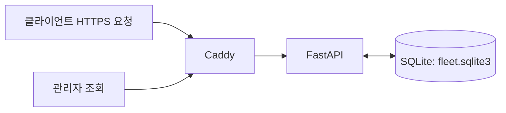
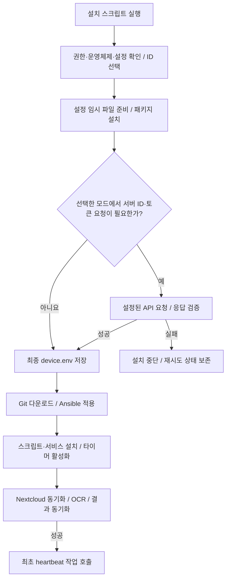

# Fleet OCR 실행 흐름

현재 코드의 동작을 서버와 클라이언트로 나누어 설명합니다.
소스 경로는 이 문서가 있는 `ubuntu-fleet-ocr` 디렉터리 기준이며,
`/etc/sononet`, `/var/lib/sononet` 등은 설치 대상 Ubuntu 장비의 경로입니다.

**기본 동작은 클라이언트에서 ID를 직접 설정하는 것입니다.** ID 서버에 접속하지 않아도
ID 저장과 OCR 설치를 진행할 수 있습니다. 서버 ID 할당·수동 ID 인증은 선택 기능입니다.
코드 다운로드, 패키지 설치, Nextcloud 동기화와 OCR API 사용에는 별도 네트워크 연결이 필요합니다.

## 1. 서버 동작

### 1.1 서버별 역할

| 서버 | 담당 기능 | 클라이언트 설정 |
| --- | --- | --- |
| Git 서버 | Ansible 플레이북과 OCR 클라이언트 코드 배포 | `SONONET_REPO_URL`, `SONONET_REPO_BRANCH`, `SONONET_PLAYBOOK_PATH` |
| ID 발급·인증 서버 | 선택적 자동 번호 할당, 수동 ID용 인증 토큰 제공 | `FLEET_ID_API_URL`, `FLEET_ID_REGISTER_PATH`, `FLEET_ID_MANUAL_PATH` |
| Fleet 상태 서버 | heartbeat·이벤트 저장, ID 충돌 검사와 관리자 조회 | `FLEET_API_URL` |
| Nextcloud 서버 | 원본 이미지와 OCR 결과 동기화 | `NEXTCLOUD_URL` 및 Nextcloud 계정 설정 |
| OCR 추론 서버 | 이미지에서 텍스트 추출 | `OCR_API_BASE_URL`, `OCR_API_KEY`, `OCR_MODEL` |

`central/api/main.py`는 ID 발급·인증과 Fleet 상태 API를 함께 제공합니다.
`central/compose.yaml`은 이 API와 HTTPS 프록시인 Caddy를 실행합니다.
Git·Nextcloud·OCR 추론 서버는 이 Compose 구성에 포함되어 있지 않습니다.

### 1.2 중앙 API 시작

1. 관리자가 `central/.env.example`을 `central/.env`로 복사하고 실제 값을 설정합니다.
2. `central` 디렉터리에서 `docker compose up -d --build`를 실행합니다.
3. `control-api` 컨테이너가 Uvicorn으로 `main:app`을 내부 포트 `8080`에서 실행합니다.
4. API가 환경변수를 검사하고 SQLite 테이블·인덱스를 준비합니다.
5. Caddy가 외부 HTTPS 요청을 `control-api:8080`으로 전달합니다.



**입력 위치:** 서버의 `central/.env`. 아래 예시 도메인은 실제 운영 주소가 아니므로 교체합니다.

| 서버 설정 | 필수 여부 | 입력 예시·기본값 | 의미·입력 방법 |
| --- | --- | --- | --- |
| `FLEET_DOMAIN` | 중앙 서버 실행 시 필수 | `fleet.example.com` | 실제 서버 IP를 가리키는 도메인. 이 구성에서는 `https://` 없이 입력 |
| `FLEET_HMAC_SECRET` | 필수 | `openssl rand -hex 32`로 생성한 값 | 32자 이상. 장비 ID별 인증 토큰 생성·검증용이며 서버에만 보관 |
| `ADMIN_TOKEN` | 필수 | 별도로 생성한 무작위 값 | 24자 이상. 관리자 조회용이며 장비에 배포하지 않음 |
| `FLEET_ENROLLMENT_TOKEN` | 서버 ID 할당·수동 ID 인증을 사용할 때 필수 | 기본 빈 값 | 사용 시 32자 이상의 별도 무작위 값. 해당 기능을 쓸 장비에도 같은 값을 입력 |
| `FLEET_ID_CONFLICT_WINDOW_SECONDS` | 선택 | `86400` | 충돌 비교 기간(초). 최소 `60` |
| `FLEET_DB_PATH` | 기본값 사용 가능 | `/data/fleet.sqlite3` | API의 DB 경로. 현재 Compose의 `environment`에 고정되어 있어 `.env`에 추가하는 것만으로 변경되지 않음 |

서버 설정 예시입니다. 비밀값의 `REPLACE_...` 부분은 각각 독립적으로 생성한 실제 값으로 교체합니다.

```dotenv
# central/.env
FLEET_DOMAIN=fleet.example.com
FLEET_HMAC_SECRET=REPLACE_WITH_RANDOM_HMAC_SECRET
ADMIN_TOKEN=REPLACE_WITH_RANDOM_ADMIN_TOKEN
FLEET_ENROLLMENT_TOKEN=
FLEET_ID_CONFLICT_WINDOW_SECONDS=86400
```

```bash
# 비밀값 하나를 생성하는 명령. 필요한 비밀값마다 별도로 실행합니다.
openssl rand -hex 32
# central 디렉터리에서 설정 적용
docker compose up -d --build
```

주소 연결 관계는 다음과 같습니다. 기본 Compose는 Caddy의 호스트 포트 `80`·`443`을 사용하고,
API의 `8080`은 Docker 내부에서 사용합니다.

| 서버에서 준비할 주소·정보 | 클라이언트에 입력할 값 |
| --- | --- |
| Fleet 도메인 `fleet.example.com` | `FLEET_API_URL=https://fleet.example.com` |
| 같은 서버에서 ID 발급·인증 제공 | `FLEET_ID_API_URL`을 비워 위 주소를 사용하거나 동일한 HTTPS 주소 입력 |
| 별도 ID 서버 `id.example.com:8443` | `FLEET_ID_API_URL=https://id.example.com:8443` 및 실제 API 경로 |
| 기존 Nextcloud의 접속 URL·계정·앱 비밀번호 | `NEXTCLOUD_URL`, `NEXTCLOUD_USER`, `NEXTCLOUD_APP_PASSWORD` |
| 이미지 입력을 지원하는 OCR API의 기본 URL·API 키·모델 이름 | `OCR_API_BASE_URL`, `OCR_API_KEY`, `OCR_MODEL` |

Nextcloud·OCR 서버 설정 자체는 각 서버에서 별도로 준비합니다. `central/.env`에 이들의
주소를 추가하는 방식이 아니라, 준비된 접속 정보를 각 클라이언트 설정 파일에 입력합니다.

`FLEET_ENROLLMENT_TOKEN`이 비어 있으면 자동 할당·수동 ID 인증 API는 `503`으로 응답합니다.
기존 장비 토큰을 가진 장비의 상태 보고와 충돌 검사는 계속 사용할 수 있습니다.

### 1.3 ID 요청 처리

**기본 로컬 ID 설정에는 서버 요청이 없습니다.** 다음 처리는 클라이언트가 선택했을 때만 실행합니다.

| 요청 | 입력 | 서버 처리 | 응답 |
| --- | --- | --- | --- |
| `POST /v1/devices/register` | 장비에 저장된 `registration_key` | 등록 키 해시를 조회하고, 없으면 사용하지 않은 `SN-000001` 형식의 번호 할당 | `device_id`, `device_token` |
| `POST /v1/devices/manual` | 사용자가 지정한 `device_id` | 입력 ID를 유지하고 해당 ID의 인증 토큰 생성. 중복 ID도 허용 | 입력한 `device_id`, `device_token` |

두 요청은 `Authorization: Bearer <FLEET_ENROLLMENT_TOKEN>`으로 인증합니다.
인증 헤더가 없으면 `401`, 토큰이 틀리면 `403`, 입력 형식이 틀리면 `422`로 응답합니다.

자동 할당은 `BEGIN IMMEDIATE` 트랜잭션 안에서 조회·번호 선택·저장을 수행하며,
DB 고유 제약조건으로 같은 번호가 중복 저장되는 것을 막습니다.
응답이 유실되어도 동일한 등록 키로 다시 요청하면 기존 ID와 토큰을 반환합니다.
기존 heartbeat·event에서 확인된 ID와 수동 인증으로 저장한 ID도 자동 할당 시 제외합니다.

장비 인증 토큰은 서버 비밀값과 `device_id`의 HMAC으로 계산됩니다.
따라서 수동으로 같은 ID를 사용한 장비는 동일한 ID용 토큰을 사용할 수 있으며,
서로 다른 장비인지는 다음 절의 `instance_id`로 구분합니다.

### 1.4 상태 보고 수신과 충돌 판정

1. 클라이언트가 `POST /v1/heartbeat`로 `device_id`, `instance_id`, 호스트명과 상태를 보냅니다.
2. 서버가 `DEVICE_TOKEN`을 해당 `device_id`의 토큰과 비교합니다. 인증 실패 시 기록하지 않습니다.
3. heartbeat를 저장하고, 내부 식별자별 현재 ID·호스트명·서버 수신 시각을 갱신합니다.
4. 같은 ID를 최근 비교 기간 안에 보고한 서로 다른 내부 식별자의 수를 계산합니다.
5. 결과를 `id_check`에 담아 `202` 응답으로 반환합니다.

| 판정 | 조건 |
| --- | --- |
| `clear` | 비교 기간 안에 해당 ID를 보고한 내부 식별자가 1개 이하 |
| `conflict` | 서로 다른 내부 식별자가 2개 이상 |
| `unverified` | 요청에 내부 식별자가 없는 구버전 클라이언트 |

충돌이면 서버 로그에 `device_id_conflict` 경고를 기록합니다.
두 번째 장비는 해당 응답에서, 먼저 보고한 장비는 다음 heartbeat 응답에서 충돌을 알게 됩니다.
서버가 클라이언트에 별도로 푸시하거나 이메일을 보내는 기능은 없습니다.

한 장비의 ID를 수정하면 그 장비의 다음 heartbeat에서 기존 ID 사용 기록이 새 ID로 이동합니다.
보고가 끊긴 장비는 기본 24시간이 지나면 비교 대상에서 제외되고, 다시 보고하면 재검사합니다.
시간 기준은 클라이언트가 주장하는 시각이 아니라 **서버 수신 시각**입니다.
주기 실행은 클라이언트 타이머가 담당하며, 서버는 요청을 받을 때 판정합니다.

### 1.5 저장과 관리자 확인

| SQLite 테이블 | 저장 내용 |
| --- | --- |
| `device_registry` | 알려진 ID와 자동 등록 키의 해시 |
| `device_sequence` | 다음 자동 할당 번호 |
| `device_instances` | 내부 식별자별 현재 ID·호스트명·최근 수신 시각 |
| `heartbeats` | 장비 상태 보고 이력 |
| `events` | 배포·파이프라인 이벤트 이력 |

DB는 `fleet-data` 볼륨에 유지됩니다. 여러 독립 DB 사이의 전역 ID 중복 방지는 제공하지 않습니다.
자동 번호를 계속 일관되게 발급하려면 DB와 서버 비밀값을 보존해야 합니다.

관리자 토큰을 설정한 셸에서 다음과 같이 조회합니다.

```bash
# API 기동 확인: 인증 불필요
curl https://fleet.example.com/healthz
# 현재 충돌: 장비 ID, 내부 식별자, 호스트명, 최근 수신 시각
curl -H "Authorization: Bearer $ADMIN_TOKEN" https://fleet.example.com/v1/id-conflicts
# 알려진 ID 목록: heartbeat 전 등록된 ID도 포함
curl -H "Authorization: Bearer $ADMIN_TOKEN" https://fleet.example.com/v1/registrations
# ID별 최신 heartbeat
curl -H "Authorization: Bearer $ADMIN_TOKEN" https://fleet.example.com/v1/devices
```

상세 이력은 `/v1/devices/{device_id}/heartbeats`와 `/v1/devices/{device_id}/events`에서 조회합니다.
최신 상태 목록은 ID별 한 건이므로, 같은 ID를 쓰는 장비 구분에는 충돌 API를 사용합니다.

## 2. 클라이언트 동작

### 2.1 전원 켜기와 최초 실행

최초에는 Ubuntu/Debian 장비를 부팅한 후 관리자가 `client/install.sh`를 실행합니다.
**아직 설치하지 않은 장비에서 전원을 켜는 것만으로 설치 스크립트가 실행되지는 않습니다.**
최초 설치를 마친 이후부터 systemd 타이머가 부팅 후 작업을 자동 실행합니다.

기본 준비 파일은 `client/install.sh`와 `client/device.env.example`입니다.
서버 발급·인증을 선택할 때는 `client/register_device.py`를 같은 디렉터리에 둡니다.
장비에 복사한 파일들이 있는 디렉터리에서 다음과 같이 실행합니다.

```bash
sudo install -m 0600 device.env.example /root/sononet-device.env
sudoedit /root/sononet-device.env
sudo bash install.sh /root/sononet-device.env --device-id LAB-001
```

Nextcloud 계정·비밀번호, OCR 서버 주소·API 키를 실제 값으로 설정합니다.
현재 OCR 작업기는 실행 시 비어 있지 않은 `OCR_API_KEY`를 요구합니다.

### 2.2 ID 설정 방식 선택

| 방식 | 설정 또는 실행 옵션 | ID 서버 연결 |
| --- | --- | --- |
| 직접 입력 — 기본 | `SONONET_ID_MODE=manual`, `SONONET_FETCH_DEVICE_TOKEN=0` | 연결하지 않음 |
| 직접 입력 + 인증 토큰 요청 | `manual`, `SONONET_FETCH_DEVICE_TOKEN=1`, 빈 `DEVICE_TOKEN` | 수동 ID 인증 API만 요청 |
| 서버 자동 할당 — 선택 | `--server-id`, 또는 `auto` + 빈 ID·장비 토큰 | 자동 할당 API 요청 |
| 기존 인증 정보 재사용 | 설정 파일에 ID와 해당 ID의 장비 토큰 유지 | ID 서버 요청 생략 |

모드를 생략하거나 비우면 `manual`입니다. 명시적으로 설정된 `auto`는 유지합니다.
수동 모드에서 ID가 비어 있고 터미널 입력이 가능하면 `Device ID:`로 입력을 받습니다.
무인 실행에서 ID가 비어 있으면 종료하며 서버 자동 할당으로 전환하지 않습니다.

기본 실행 중 다음 안내를 출력합니다.

```text
클라이언트에서 ID를 직접 설정합니다. ID 설정 서버에는 기본적으로 연결하지 않습니다.
서버에서 ID를 할당받을 수도 있습니다: --server-id (서버 주소와 FLEET_ENROLLMENT_TOKEN 설정 필요).
```

`--device-id LAB-001`은 수동 모드를 선택하며, 기존 ID와 다르면 이전 장비 토큰을 비웁니다.
`--server-id`는 자동 모드를 선택하고 기존 ID·토큰을 비워 서버에 요청합니다.
두 옵션은 동시에 사용할 수 없습니다. 자동 등록 키가 이미 있다면 서버는 그 키의 기존 ID를 반환합니다.

ID 형식은 영문·숫자로 시작하는 1~128자의 영문·숫자·점·밑줄·하이픈입니다.
수동 입력에서는 중복 ID도 저장하며, 충돌 시 ID 자동 변경이나 OCR 중지는 하지 않습니다.

### 2.3 선택적 서버 접속 설정

**입력 위치:** 최초에는 클라이언트의 `/root/sononet-device.env`입니다.
`client/device.env.example`을 복사한 뒤 실제 값을 입력합니다.
설치 후 최종 설정은 `/etc/sononet/device.env`에 저장됩니다.
비밀번호·토큰에 공백이나 셸 특수문자가 있으면 작은따옴표로 감싸고, 설정 파일은 `0600` 권한으로 유지합니다.

#### 2.3.1 기본 로컬 ID·OCR 실행에 필요한 값

| 설정 | 필수 여부 | 입력 예시·기본값 | 설명 |
| --- | --- | --- | --- |
| `SONONET_DEVICE_ID` | 수동 모드에서 필수 | `LAB-001` | Nextcloud 로그인 계정과 다른 장비 식별용 ID. 설정 파일·`--device-id`·터미널 입력 중 하나로 지정 |
| `SONONET_ID_MODE` | 선택 | `manual` | 기본 로컬 직접 입력. 서버 자동 할당을 선택하면 `auto` |
| `SONONET_FETCH_DEVICE_TOKEN` | 선택 | `0` | 기본은 ID 서버 인증 요청 없음. `1`이면 수동 ID의 토큰을 선택적으로 요청 |
| `NEXTCLOUD_URL` | 필수 | `https://cloud.example.com` | 실제 Nextcloud 서버의 접속 URL. 하위 경로에 설치했다면 그 경로도 포함 |
| `NEXTCLOUD_USER` | 필수 | `ocr-device-user` | 해당 Nextcloud 서버에 존재하는 로그인 계정 |
| `NEXTCLOUD_APP_PASSWORD` | 필수 | 계정에서 발급한 앱 비밀번호 | 장비 ID나 Fleet 토큰을 넣는 항목이 아님 |
| `OCR_API_BASE_URL` | 필수 | `https://ocr.example.com` | OCR API 기본 주소. 코드가 `/v1/chat/completions`를 붙이므로 이 요청 경로나 `/v1`을 중복 입력하지 않음 |
| `OCR_API_KEY` | OCR 실행 시 필수 | OCR 서버의 실제 API 키 | 현재 작업기는 빈 값을 허용하지 않음 |
| `OCR_MODEL` | 선택 | `google/gemma-4-31B-it` | OCR 서버에서 실제 제공하는 모델 이름과 일치해야 함 |

OCR API 주소는 HTTPS를 사용합니다. 현재 작업기는 localhost·127.0.0.1로 시작하는
로컬 추론 주소에 한해 HTTP도 허용합니다. 원격 OCR 서버에는 HTTPS 주소를 입력합니다.

Git 다운로드 설정은 기본 BerePi 저장소를 사용하면 수정하지 않아도 됩니다.

| 설정 | 기본값 | 변경이 필요한 경우 |
| --- | --- | --- |
| `SONONET_REPO_URL` | `https://github.com/jeonghoonkang/BerePi.git` | 다른 Git 저장소에서 코드를 받을 때 |
| `SONONET_REPO_BRANCH` | `master` | 다른 배포 브랜치를 사용할 때 |
| `SONONET_PLAYBOOK_PATH` | `apps/agentai/ansible_agent/ubuntu-fleet-ocr/local.yml` | 저장소 내 경로가 다를 때. fleet-ocr만 별도 저장소라면 `local.yml` |
| `SONONET_VERIFY_COMMIT` | `0` | 서명 검증을 준비한 장비에서만 `1`. 신뢰할 공개키와 서명된 배포 커밋 필요 |

#### 2.3.2 ID 서버·상태 보고 기능을 선택할 때 필요한 값

| 설정 | 필요 조건 | 입력 예시·기본값 | 설명 |
| --- | --- | --- | --- |
| `FLEET_API_URL` | 상태 보고·충돌 확인 사용 시 | 기본 빈 값, 예: `https://fleet.example.com` | Fleet 상태 API의 기본 주소. `/v1/heartbeat`까지 입력하지 않음 |
| `DEVICE_TOKEN` | 상태 보고·충돌 확인 사용 시 | 기본 빈 값 | 해당 장비 ID의 인증 토큰. 서버 자동 응답 또는 관리자의 `central/make_device_token.py` 출력으로 설정 |
| `FLEET_ID_API_URL` | 서버 ID 할당·수동 ID 인증 선택 시 | 기본 `FLEET_API_URL` 사용 | 별도 ID 서버라면 HTTPS 주소·포트·프록시 접두 경로 입력 |
| `FLEET_ID_REGISTER_PATH` | 자동 ID 할당 요청 시 | `/v1/devices/register` | ID 서버 주소 뒤에 붙는 자동 할당 API 경로 |
| `FLEET_ID_MANUAL_PATH` | 수동 ID 인증 요청 시 | `/v1/devices/manual` | ID 서버 주소 뒤에 붙는 수동 ID 인증 API 경로 |
| `FLEET_ENROLLMENT_TOKEN` | 자동 할당 또는 `SONONET_FETCH_DEVICE_TOKEN=1`로 토큰 요청 시 | 기본 빈 값 | ID 서버의 동명 설정과 동일한 32자 이상 등록 전용 토큰 |

`DEVICE_TOKEN`, `FLEET_ENROLLMENT_TOKEN`, `OCR_API_KEY`, `NEXTCLOUD_APP_PASSWORD`는
서로 다른 용도의 인증 정보입니다. 서버의 `ADMIN_TOKEN`과 `FLEET_HMAC_SECRET`은 클라이언트에 넣지 않습니다.

실행 방식별로 추가해야 할 값은 다음과 같습니다. 모든 방식에서 Nextcloud·OCR 설정은 필요합니다.

| 실행 방식 | ID·서버 설정 |
| --- | --- |
| 로컬 ID로 OCR만 실행 | 수동 ID, `SONONET_FETCH_DEVICE_TOKEN=0`. Fleet 관련 주소·토큰은 비워도 됨 |
| 로컬 ID + 이미 발급된 토큰으로 충돌 확인 | 위 설정에 `FLEET_API_URL`, 해당 ID의 `DEVICE_TOKEN` 추가 |
| 로컬 ID + 서버에서 인증 토큰 받기 | `manual`, `SONONET_FETCH_DEVICE_TOKEN=1`, 빈 `DEVICE_TOKEN`, ID 서버 주소·등록 토큰 설정. 충돌 확인에는 `FLEET_API_URL`도 필요 |
| 서버에서 ID 자동 할당받기 | ID 서버 주소·등록 토큰을 설정하고 `--server-id`로 실행. 충돌 확인에는 `FLEET_API_URL`도 필요 |

다음은 ID·상태 서버 접속을 선택한 경우의 주소 예시입니다.

```bash
# 상태 보고·충돌 검사 서버: 사용할 때 설정
FLEET_API_URL=https://fleet.example.com
# ID 발급·인증 서버: 비어 있으면 FLEET_API_URL 사용
FLEET_ID_API_URL=https://id.example.com:8443/fleet
FLEET_ID_REGISTER_PATH=/v1/devices/register
FLEET_ID_MANUAL_PATH=/v1/devices/manual
# 발급·인증 서버와 동일한 등록 전용 토큰
FLEET_ENROLLMENT_TOKEN='실제 등록 전용 토큰'
```

서버 주소 뒤에 선택한 API 경로를 붙입니다. 위 자동 할당 URL은
`https://id.example.com:8443/fleet/v1/devices/register`입니다.
경로는 서버 코드의 파일 경로가 아니라 HTTP API 경로이며, 실제 서버·프록시에서 연결되어 있어야 합니다.
ID 발급·인증 요청은 HTTPS만 허용하고 리다이렉트를 따르지 않습니다.
ID 서버를 분리하면 상태 서버가 발급 토큰을 검증할 수 있도록 동일한 HMAC 비밀값을 사용하고
장비 DB를 일관되게 운영해야 합니다. HMAC 비밀값과 관리자 토큰은 장비에 복사하지 않습니다.

자동 할당에서는 요청 전에 `/etc/sononet/registration.json`에 등록 키를 저장합니다.
전송 실패·일부 서버 오류에 최대 3번 재시도하며, 최종 실패하면 키를 보존하고 설치를 중단합니다.
다음 실행에서도 같은 키를 사용합니다. 이미 저장된 키의 ID 서버 주소가 달라지면 오류로 중단합니다.
수동 ID 인증은 자동 등록 키를 만들지 않고 지정한 ID만 보냅니다.

#### 2.3.3 폴더·OCR 처리량 설정

아래 항목은 기본값을 유지해도 됩니다. 숫자 항목에는 단위 문자를 붙이지 않습니다.

| 설정 | 기본값 | 의미 |
| --- | --- | --- |
| `NEXTCLOUD_REMOTE_PATH` | 비어 있으면 `/Fleet/<장비 ID>` | Nextcloud에서 동기화할 원격 폴더. 미리 생성하고 계정의 접근 권한 확인 |
| `NEXTCLOUD_LOCAL_DIR` | `/var/lib/sononet/sync` | 장비의 동기화 폴더 |
| `OCR_INPUT_SUBDIR` | `inbox` | 동기화 폴더 아래 입력 이미지 디렉터리 |
| `OCR_OUTPUT_SUBDIR` | `ocr-results` | 동기화 폴더 아래 결과 디렉터리 |
| `OCR_MAX_FILES_PER_RUN` | `25` | 한 번 실행할 때 새로 처리할 최대 파일 수 |
| `OCR_MAX_FILE_BYTES` | `20971520` | 파일당 최대 크기. 기본 20 MiB |
| `OCR_STABLE_AGE_SECONDS` | `30` | 최종 수정 후 이 시간이 지난 이미지부터 처리 |
| `OCR_STATE_DB` | `/var/lib/sononet/ocr-state.sqlite3` | OCR 처리 이력을 저장하는 장비 DB |

로컬 경로를 바꿀 때는 서비스 계정의 쓰기 권한과 systemd의 쓰기 허용 경로도 맞춰야 합니다.
기본 서비스는 `/var/lib/sononet` 아래에 쓸 수 있도록 구성되어 있습니다.
작업 주기는 환경변수가 아니라 2.5절의 Ansible 역할 기본값에서 변경합니다.

#### 2.3.4 최소 입력 예시와 적용 방법

기본 로컬 ID 방식으로 사용할 클라이언트 설정 예시입니다. 아래 `REPLACE_...` 값과
서버 주소·계정은 실제 운영 값으로 교체합니다. 생략된 Git·폴더·처리량 항목은 기본값을 사용합니다.

```dotenv
# /root/sononet-device.env
SONONET_ID_MODE=manual
SONONET_DEVICE_ID=LAB-001
SONONET_FETCH_DEVICE_TOKEN=0

NEXTCLOUD_URL=https://cloud.example.com
NEXTCLOUD_USER=ocr-device-user
NEXTCLOUD_APP_PASSWORD='REPLACE_WITH_NEXTCLOUD_APP_PASSWORD'
OCR_API_BASE_URL=https://ocr.example.com
OCR_API_KEY='REPLACE_WITH_OCR_API_KEY'
OCR_MODEL=google/gemma-4-31B-it

FLEET_API_URL=
DEVICE_TOKEN=
FLEET_ENROLLMENT_TOKEN=
```

```bash
# 장비에 복사한 install.sh가 있는 디렉터리에서 실행
sudo bash install.sh /root/sononet-device.env
# 설정 파일의 ID 대신 명령행으로 지정할 수도 있음
sudo bash install.sh /root/sononet-device.env --device-id LAB-002
```

서버에서 ID를 받으려면 원본 설정 파일에 `FLEET_ID_API_URL`, 실제 `FLEET_ENROLLMENT_TOKEN`을
입력하고 `register_device.py`를 함께 준비한 뒤 실행합니다.

```bash
sudo bash install.sh /root/sononet-device.env --server-id
```

설치 후 설정을 변경할 때는 사용할 파일을 명확히 선택합니다.
원본 `/root/sononet-device.env`를 수정했다면 그 파일로 설치기를 재실행합니다.
발급받은 ID·토큰이 있는 최종 파일을 수정하려면 `sudoedit /etc/sononet/device.env` 후
`sudo bash install.sh /etc/sononet/device.env`로 적용합니다.
설치기는 지정한 파일을 기준으로 최종 설정을 다시 저장합니다.
ID가 변경되면 이전 ID의 토큰을 재사용하지 말고 새 ID에 맞는 토큰을 설정하거나
선택적 인증 요청을 사용합니다.

### 2.4 설치와 최초 OCR 실행



실행 순서는 다음과 같습니다.

1. root 권한, Ubuntu/Debian, systemd 환경과 설정 파일을 확인합니다.
2. ID 모드와 필수 설정을 검사하고 업데이트와 공유하는 `flock` 잠금을 획득합니다.
3. `/etc/sononet`에 임시 설정 파일을 만들고 Ansible·Git·인증서·Python을 설치합니다.
4. 선택한 경우에만 서버 발급·인증을 요청합니다. 실패하면 기존 최종 설정을 덮어쓰지 않습니다.
5. ID·토큰·접속 설정을 `/etc/sononet/device.env`에 `0600` 권한으로 저장합니다.
6. `ansible-pull`이 저장소를 내려받고 지정한 플레이북을 로컬에서 실행합니다.
7. 역할이 서비스 계정, 실행 스크립트, systemd 서비스·타이머를 설치하고 타이머를 활성화합니다.
8. 설치기가 `sononet-pipeline.service`를 즉시 실행하고 성공하면 `sononet-heartbeat.service`를 호출합니다.

기본 다운로드 대상은 `https://github.com/jeonghoonkang/BerePi.git`의 `master`이며,
플레이북 경로는 `apps/agentai/ansible_agent/ubuntu-fleet-ocr/local.yml`입니다.
변경된 코드를 장비가 받으려면 먼저 해당 다운로드 브랜치에 반영되어 있어야 합니다.

`pipeline.sh`는 Nextcloud 동기화 → `ocr_worker.py` → Nextcloud 동기화 순서로 실행합니다.
작업기는 안정화된 `inbox` 이미지를 읽고 경로·해시·모델·프롬프트 버전으로 중복 처리를 검사합니다.
OCR 결과를 `ocr-results`의 `.ocr.txt`, `.ocr.json`에 저장하고 SQLite에 처리 상태를 기록합니다.
마지막 동기화가 결과를 Nextcloud에 업로드합니다.

기본 원격 경로는 `/Fleet/<장비 ID>`입니다. Nextcloud 사용자·원격 폴더는 별도로 준비합니다.
같은 ID의 장비를 분리하려면 `NEXTCLOUD_REMOTE_PATH`도 장비별로 설정합니다.

### 2.5 설치 후 재부팅과 주기 작업

| 타이머 | 부팅 후 시작 기준 | 기본 반복 기준 | 추가 무작위 지연 | 수행 작업 |
| --- | --- | --- | --- | --- |
| `sononet-heartbeat.timer` | 1분 | 5분 | 최대 1분 | 상태 보고·ID 충돌 확인 |
| `sononet-pipeline.timer` | 2분 | 10분 | 최대 2분 | Nextcloud 동기화·OCR |
| `sononet-ansible-pull.timer` | 3분 | 30분 | 최대 10분 | Git 업데이트·설정 재적용 |

위 값은 `OnBootSec`, `OnUnitActiveSec`, `RandomizedDelaySec` 기준이며 정확한 시각을 보장하지 않습니다.
설치기의 즉시 실행은 타이머에 의한 실행과 별개입니다.
주기는 `roles/sononet_edge/defaults/main.yml`에서 변경합니다.
정기 업데이트는 저장된 설정으로 플레이북을 재적용하며, 설치기를 다시 실행하거나 ID를 다시 발급하지 않습니다.

### 2.6 클라이언트에서 충돌 확인

1. 최초 heartbeat 작업에서 `/var/lib/sononet/instance-id`를 만들고 이후 재사용합니다.
2. `FLEET_API_URL` 또는 `DEVICE_TOKEN`이 없으면 전송을 생략합니다.
   `heartbeat_skipped` 안내를 기록하고 충돌 결과를 `unverified`로 저장합니다.
3. 둘 다 있으면 ID·내부 식별자와 장비 상태를 서버에 보냅니다.
4. 응답의 `id_check`를 `/var/lib/sononet/id-conflict.json`에 저장합니다.
5. 충돌이면 journal에 `device_id_conflict`를 기록합니다. 다음 정상 판정은 기존 결과를 갱신합니다.

통신 오류나 지원되지 않는 서버 응답도 `unverified`로 처리하며 충돌이 없다고 표시하지 않습니다.
별도의 내부 식별자가 있어야 비교가 가능하므로 `instance-id`를 다른 장비나 출하 이미지에 복제하지 않습니다.
이 식별자는 설치 구분용이며 하드웨어 신원을 보증하지 않습니다.

```bash
systemctl list-timers 'sononet-*'
journalctl -u sononet-heartbeat.service -n 100 --no-pager
sudo cat /var/lib/sononet/id-conflict.json
journalctl -u sononet-pipeline.service -n 100 --no-pager
journalctl -u sononet-ansible-pull.service -n 100 --no-pager
```

### 2.7 보존 파일과 실패 시 동작

| 장비 경로 | 역할 |
| --- | --- |
| `/etc/sononet/device.env` | 최종 ID·서버 설정·인증 정보 |
| `/etc/sononet/registration.json` | 선택적 자동 발급의 재요청 키. 내부 충돌 식별자와는 별개 |
| `/var/lib/sononet/instance-id` | ID가 바뀌어도 유지하는 설치별 충돌 구분 식별자 |
| `/var/lib/sononet/id-conflict.json` | 최근 충돌 판정 |
| `/var/lib/sononet/ansible` | 내려받은 Git 저장소 |
| `/var/lib/sononet/config-revision` | 적용된 Git 커밋 |
| `/var/lib/sononet/ocr-state.sqlite3` | 기본 OCR 처리 이력 DB |
| `/var/lib/sononet/sync` | 기본 이미지·결과 동기화 폴더 |
| `/usr/local/lib/sononet` | 설치된 OCR·상태 보고 스크립트 |

설정 오류, 선택한 서버 인증 실패, 다운로드·Ansible 실패는 설치를 중단합니다.
OCR 파이프라인은 최초 동기화 실패 시 `20`, OCR 단계 실패 시 `30`, 결과 동기화 실패 시 `40`으로 종료합니다.
최초 파이프라인이 실패하면 설치기의 후속 heartbeat 호출은 생략되지만, 이미 활성화된 타이머는 남습니다.
오류 원인을 수정한 뒤 같은 설치 명령을 재실행하거나 해당 서비스를 다시 시작할 수 있습니다.

기존 최종 설정으로 재실행하려면 `sudo bash install.sh /etc/sononet/device.env`를 사용합니다.
원래 설정 파일로 재실행하면 그 파일의 값이 다시 적용됩니다.
서버 인증이 없는 기본 모드에서는 이벤트 전송도 생략하며 로컬 OCR 동작은 계속합니다.

이 문서는 현재 소스의 동작 설명이며 실제 서버 배포·Ubuntu 설치 완료를 의미하지 않습니다.
