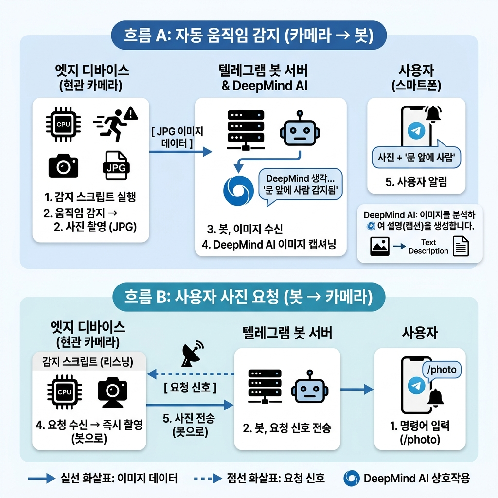

# Motion detection S/W installation (Project : Motion)

## 설치 command 
- sudo apt-get installl motion
- `ffmpeg -version`이 정상 출력되기 전까지는 Motion도 정상 동작하기 어렵습니다.
- bus 오류 확인 방법: `dmesg -T | grep -Ei "ext4|mmc|i/o error|buffer error|corrupt|segfault|bus"`

## requirements
```
Debian/Ubuntu/Raspbian
Required
sudo apt-get install autoconf automake build-essential pkgconf libtool git libzip-dev libjpeg-dev gettext libmicrohttpd-dev
```
## configuration 
- /etc/modules
  - bcm2835-v4l2
- /etc/motion/motion.conf
  - event_gap 단위는 초
- 파일 저장 경로 /var/lib/motion
   
 <pre>   
############################################################
       # Picture output configuration parameters
############################################################
    # Output pictures when motion is detected         
    picture_output on    

    movie_filename %Y%m%d%H%M%S-%qA
    # %출력설명, https://motion-project.github.io/4.1/motion_guide.html#conversion_specifiers
       
 </pre> 

- ls /var/lib/motion/ | wc -l | telegram-send --stdin 

## 최근 5분 사람 감지 후 Telegram 전송

`detection_5min.py` 는 `/var/lib/motion_recent` 에 저장된 최근 24시간 인덱스 중 최근 5분 이미지 파일을 원격 Gemma4 31B 모델에 보내 사람 존재 여부와 인원수를 확인합니다. 사람이 감지되면 해당 사진, 인원수, 사람이 찍힌 시각을 Telegram 으로 전송하고 `logs/person_detected_events.jsonl` 에도 저장합니다.

```bash
cd /****tinyos/devel_opment/BerePi/apps/camera/motion
python3 detection_5min.py
python3 detection_5min.py --dry-run
python3 detection_5min.py --dir /var/lib/motion_recent --minutes 5
```

모델 접속 주소, prompt, Telegram bot token/chat id, 감지 이벤트 로그 경로는 `conf_connect_model.conf` 에서 설정합니다.

## 최근 24시간 Motion 인덱스 운영

`/var/lib/motion` 전체 디렉토리에 파일이 많으면 5분마다 scan 하는 시간이 길어집니다. Motion 이 사진을 저장할 때마다 `/var/lib/motion_recent` 에 hardlink 를 만들고, `detection_5min.py` 는 이 작은 디렉토리만 scan 하도록 운영합니다.

먼저 최근 인덱스 디렉토리를 만들고 Motion 서비스 사용자가 쓸 수 있게 설정합니다. 시스템에 따라 `motion:motion` 이 다르면 실제 Motion 실행 사용자로 바꿉니다.

```bash
sudo install -d -o motion -g motion /var/lib/motion_recent
```

`/etc/motion/motion.conf` 에 사진 저장 hook 을 추가합니다. 경로는 설치된 BerePi 위치에 맞게 바꿉니다.

```conf
on_picture_save /****/devel_opment/BerePi/apps/camera/motion/motion_recent_add.sh "%f"
```

처음 전환할 때는 최근 24시간 파일을 한 번 채웁니다.

```bash
find /var/lib/motion -type f \( -iname '*.jpg' -o -iname '*.jpeg' -o -iname '*.png' -o -iname '*.webp' \) -mmin -1440 \
  -exec /****/devel_opment/BerePi/apps/camera/motion/motion_recent_add.sh {} \;
```

24시간이 지난 인덱스는 crontab 으로 정리합니다.

```cron
*/10 * * * * /****tinyos/devel_opment/BerePi/apps/camera/motion/motion_recent_cleanup.sh /var/lib/motion_recent 1440
```

이 방식은 원본 파일을 복사하지 않고 같은 파일 데이터에 이름만 하나 더 붙이는 hardlink 를 사용하므로 디스크 사용량이 거의 늘지 않습니다. `/var/lib/motion_recent` 에서 항목을 지워도 `/var/lib/motion` 원본은 유지됩니다.

## run / start / stop / daemon
- sudo systemctl status ( start / stop ) motion
  - /var/lib/motion
  - /var/log/motion/motion.log 
- hostname
- crontab for maintanance
  - 9 2 * * * /var/www/html/cam/motion/cleanup_file.sh > /home/pi/devel/BerePi/apps/debug/debug_motion.log 2>&1
  - 30 */4 * * * /var/www/html/cam/motion/del_sort.sh > /home/pi/devel/BerePi/apps/debug/debug_motion.log 2>&1

## Performance, run fact-info
- 30 Min (DESK shot)
  - generation 69MB JPG files
  - 4351 pics
- One day in office 
  - light change effect : less 5 time or slightly more
- 70 days office : 3/1 ~ 5/10
  - 123 GB, 1 day about 2 GB  
- 160 days : 2/20 ~ 7/30
  - 190 GB, 1 day about 1.2 GB

# Resource
## Source code
- Motion Project Homepage 
  - https://motion-project.github.io/index.html
  - Repo : https://github.com/Motion-Project/motion

## Links (howto)
- https://www.bouvet.no/bouvet-deler/utbrudd/building-a-motion-activated-security-camera-with-the-raspberry-pi-zero
  - https://learn.adafruit.com/cloud-cam-connected-raspberry-pi-security-camera?view=all
  - https://www.instructables.com/id/Raspberry-Pi-Motion-Detection-Security-Camera/#step5

# Copying camera capture files to SERVER
- scp -P 22 -pr /var/lib/motion tinyos@IP:webdav/gw/cam

# check file by telegram-send
<pre>  
  # 0 : device num
  # event
  # time
  telegram-send -f /var/lib/motion/0-*-20240730_0203*.mkv  
  # jpg file name :  20240719_074929-11.jpg
  # date "+%Y%m%d"
</pre>

### addition
- sudo command without asking password
  - https://www.baeldung.com/linux/sudo-non-interactive-mode
- find mtime
  - https://inpa.tistory.com/entry/LINUX-%F0%9F%93%9A-find-%EB%AA%85%EB%A0%B9-mtime-ctime-atime-%EC%98%B5%EC%85%98-n-n-%EA%B0%9C%EB%85%90-%EC%A0%95%EB%A6%AC#find_-mtime_n_%EA%B0%9C%EB%85%90_%EC%9D%B5%ED%9E%88%EA%B8%B0 


```
sudo chmod o+x /home/tinyos  # tinyos 홈 디렉토리 자체에 외부 계정 접근 허용
sudo chmod o+x /home/tinyos/devel_opment ### 하위 구조 경로들 접근 허용
sudo chmod o+x /home/tinyos/devel_opment/BerePi
sudo chmod o+x /home/tinyos/devel_opment/BerePi/apps
sudo chmod o+x /home/tinyos/devel_opment/BerePi/apps/camera
sudo chmod o+x /home/tinyos/devel_opment/BerePi/apps/camera/motion
sudo chmod 755 /home/tinyos/devel_opment/BerePi/apps/camera/motion/motion_recent_add.sh
sudo usermod -aG motion tinyos ### motion 그룹에 tinyos 유저 추가
sudo usermod -aG tinyos motion ### tinyos 그룹에 motion 유저 추가
sudo systemctl restart motion ### 서비스 재시작
sudo journalctl -u motion -f ### 실시간 로그 모니터링
sudo killall motion ### motion 프로세스를 강제로 완전히 종료 (systemd가 자동으로 다시 깨웁니다)
sudo systemctl stop motion ### 또는 서비스를 아예 중지했다가 켜기
sudo systemctl start motion
sudo journalctl -u motion -f
```

## Telegram Bot 사용자 요청 응답 (`telegram_bot.py`)

`telegram_bot.py` 는 Telegram Long Polling 데몬으로, 사용자가 Bot 에게 사진을 요청하면 `motion_recent` 에서 가장 최신 이미지를 즉시 회신합니다. `detection_5min.py` cron 과 독립적으로 병렬 동작합니다.

### 1. 설정

`conf_connect_model.conf` 의 `[telegram]` 섹션에 아래 항목을 입력합니다.

```ini
[telegram]
bot_token  = 1234567890:AAABBB...   # BotFather 에서 발급받은 토큰
chat_id    = 987654321              # 알림을 받을 기본 chat ID
# 빈칸이면 모든 사용자 허용. 특정 사용자만 허용할 경우 쉼표로 구분
bot_allowed_chat_ids =
```

`지금사진` 명령으로 실시간 촬영을 사용하려면 `[camera]` 섹션을 확인합니다. `capture_command` 가 비어 있으면 `rpicam-still`, `libcamera-still`, `fswebcam`, `imagesnap` 순서로 자동 감지합니다.

```ini
[camera]
capture_dir = /tmp/berepi_telegram_bot
# 필요 시 장비에 맞는 촬영 명령을 지정합니다. {output} 은 생성할 JPG 경로로 치환됩니다.
# capture_command = rpicam-still -n --timeout 1000 -o {output}, capture_command = fswebcam -D 1 --no-banner {output}
capture_command =
capture_timeout_seconds = 20
```

환경변수로도 설정 가능합니다.

```bash
export TELEGRAM_BOT_TOKEN="1234567890:AAABBB..."
export TELEGRAM_CHAT_ID="987654321"
```

### 2. 설정 검증 및 Bot 연결 테스트

```bash
cd /home/tinyos/devel_opment/BerePi/apps/camera/motion
python3 telegram_bot.py --test-config
```

정상이면 Bot 이름과 최신 이미지 경로가 출력됩니다.

### 3. 직접 실행 (포그라운드)

```bash
python3 telegram_bot.py
python3 telegram_bot.py --verbose          # DEBUG 로그 포함
python3 telegram_bot.py --config /path/to/conf_connect_model.conf
```

### 4. systemd 서비스로 등록 (자동 시작)

```bash
# 서비스 파일 복사 — 경로를 실제 설치 위치에 맞게 수정하세요
sudo cp logs/telegram_bot.service /etc/systemd/system/berepi-telegram-bot.service
sudo nano /etc/systemd/system/berepi-telegram-bot.service   # User / WorkingDirectory / ExecStart 경로 확인

# 등록 및 시작
sudo systemctl daemon-reload
sudo systemctl enable berepi-telegram-bot   # 부팅 시 자동 시작
sudo systemctl start  berepi-telegram-bot

# 상태 확인 / 실시간 로그
sudo systemctl status berepi-telegram-bot
sudo journalctl -u berepi-telegram-bot -f
```

### 5. Bot 명령어

Telegram 에서 Bot 에게 아래 키워드 중 하나를 포함한 메시지를 보내면 이미지가 회신됩니다.

| 명령어 | 동작 |
|--------|------|
| `/photo`, `/snap`, `/latest` | 저장된 최신 이미지 전송 |
| `사진`, `사진 찍어줘`, `사진 보내줘` | 저장된 최신 이미지 전송 |
| `찍어줘`, `캡처`, `명령 찍어`, `명령 촬영` | 저장된 최신 이미지 전송 |
| `photo`, `snap`, `camera` | 저장된 최신 이미지 전송 |
| `지금사진`, `지금 사진`, `현재사진`, `/nowphoto`, `/capture` | 카메라로 실시간 촬영 후 JPG 전송 |

## 시스템 동작 흐름


| 흐름 | 방향 | 설명 |
|------|------|------|
| **흐름 A** | 카메라 → 봇 | 움직임 감지 시 자동으로 Telegram 알림 전송 (`detection_5min.py` cron) |
| **흐름 B** | 봇 → 카메라 | 사용자가 `/photo` 명령 시 최신 이미지 즉시 회신, `지금사진` 명령 시 실시간 촬영 후 회신 (`telegram_bot.py` 데몬) |


### conf_connect_model.conf 설정 방법
- 텔레그램으로 '명령 지금사진' 입력하였을때, 스냅샷 촬영하여 전송하는 동작시, motion 서비스에서 USB캠을 사용중이기 때문에, motion에서 제공하는 웹 인터페이스로 해당 동작 실행
```
[camera]
# telegram_bot.py uses this for live capture requests such as "지금사진".
# If capture_command is empty, it auto-detects rpicam-still, libcamera-still,
# fswebcam, or imagesnap.
capture_dir = /tmp/berepi_telegram_bot
# Example:
# capture_command = rpicam-still -n --timeout 1000 -o {output}
capture_command = sh -c 'curl -fsS http://localhost:8080/0/action/snapshot >/dev/null && sleep 1 && cp /var/lib/motion/lastsnap.jpg "$1"' sh {output}
capture_timeout_seconds = 20
```

#### motion이 제공하는 웹 스냅샷(Snapshot) 기능 활용
- motion은 이미 카메라를 붙잡고 계속 구동 중이므로, 직접 카메라에 접근하는 대신 "motion아, 지금 찍고 있는 화면 한 장만 구워줘"라고 네트워크(HTTP API)로 요청하는 방식입니다. 이 방식을 쓰면 충돌이 전혀 발생하지 않습니다.
- motion.conf 설정 확인 및 변경
- motion 설정 파일에서 웹 제어 및 스냅샷 기능을 활성화해야 합니다.
```
sudo nano /etc/motion/motion.conf
아래 항목들을 찾아 기본값(정지 또는 로컬 전용)을 활성화해 줍니다.

# 웹 제어 포트 지정 (기본값 8080)
webcontrol_port 8080

# 로컬 외에 텔레그램 봇 등 내부 프로세스 접근을 위해 제한 해제 (기본값 on을 off로 변경)
webcontrol_localhost off

서비스 재시작
sudo systemctl restart motion
```
