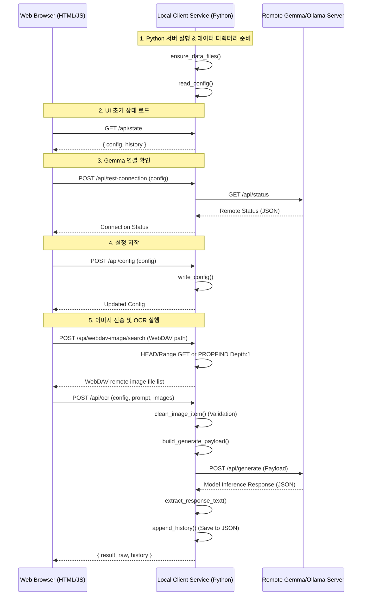

# Gemma OCR Client - Specification (`spec.md`)

이 문서에서는 **Gemma OCR Client**의 전반적인 실행 흐름(Run Flow)과 내부 Python API 및 HTTP 엔드포인트의 입력/출력 매개변수 사양을 정의합니다.

---

## 1. 실행 흐름 (Run Flow)

전체 애플리케이션의 라이프사이클 및 데이터 흐름은 다음과 같습니다.



### 세부 단계 설명:
1. **서버 시작 및 파일 검증**: `client_service.py`가 구동되면 `ensure_data_files()` 함수를 통해 필요한 설정 파일(`data/client_config.json`)과 히스토리 파일(`data/ocr_history.json`)이 준비되었는지 검사하고 없는 경우 샘플 설정을 복제하여 생성합니다.
2. **초기 상태 조회**: 웹 브라우저에서 클라이언트에 접속하면 `/api/state` API를 호출하여 설정 정보 및 최근 실행했던 OCR 히스토리를 반환받아 화면에 구성합니다.
3. **연결 및 통신 확인**:
   - **연결 확인**: 사용자가 '연결 확인' 버튼을 누르면 `/api/test-connection` 엔드포인트를 통해 원격 Ollama/Gemma 서버의 `/api/status` (혹은 지정된 경로)로 요청을 전송해 원격 서버의 구동 유무를 검사합니다.
   - **이미지 전송 확인**: 런타임 추론(Inference) 비용을 발생시키지 않고 서버에 파일 데이터를 실어 보낼 수 있는지 테스트하기 위해 `/api/test-image-transfer`를 원격 서버의 동명 API로 프록시하여 확인합니다.
4. **WebDAV 파일 검색 및 선택**: 사용자가 WebDAV 경로를 입력하면 `/api/webdav-image/search`가 직접 이미지 URL 또는 WebDAV 디렉터리에서 이미지 파일을 검색합니다. 검색된 원격 파일 목록은 브라우저의 파일 선택 영역 아래에 표시되며, 사용자가 선택한 항목만 `/api/webdav-image`로 다운로드되어 OCR 이미지 목록에 추가됩니다. 원격 파일을 체크한 상태에서 바로 OCR을 실행하면 선택된 WebDAV 파일을 먼저 다운로드한 뒤 OCR 요청 이미지에 포함합니다.
5. **OCR 수행**: 사용자가 이미지(업로드, 클립보드 또는 WebDAV 원격 파일)를 업로드하고 'OCR 실행' 버튼을 누르면 브라우저가 선택 이미지를 순서대로 한 장씩 로컬 서버로 전달합니다. 각 이미지의 OCR 응답을 받은 뒤 다음 이미지를 전송하며, 파일별 결과를 화면에 누적 표시하고 히스토리 데이터베이스에 각각 기록합니다.

---

## 2. 함수 및 클래스 사양 (Functions & Interface Spec)

`client_service.py` 내부 핵심 함수들의 입력값과 출력값 스펙입니다.

### 2.1. 설정 및 히스토리 관리 함수

#### `ensure_data_files() -> None`
- **설명**: 로컬 데이터 디렉터리(`data/`) 및 파일들(`client_config.json`, `ocr_history.json`)의 존재 여부를 점검하고 미존재 시 기본 설정을 생성합니다.

#### `normalize_config(raw: dict[str, Any] | None) -> dict[str, Any]`
- **입력**: 
  - `raw`: 사용자 혹은 파일로부터 읽어온 원본 설정 딕셔너리.
- **출력**: `DEFAULT_CONFIG` 구조를 기반으로 타입 검증 및 누락 필드 기본값 적용 처리가 완료된 딕셔너리.
  ```python
  {
      "server_base_url": str,
      "generate_path": str,
      "status_path": str,
      "request_timeout_seconds": int (최솟값 5, 기본값 600),
      "user_id": str,
      "password": str,
      "model": str,
      "keep_alive": str,
      "num_ctx": int (최솟값 0),
      "ocr_prompt": str
  }
  ```

#### `read_config() -> dict[str, Any]`
- **출력**: `data/client_config.json`에서 읽어와 정규화(Normalisation) 처리된 설정 정보 딕셔너리.

#### `write_config(config: dict[str, Any]) -> dict[str, Any]`
- **입력**:
  - `config`: 저장하려는 새로운 설정 딕셔너리.
- **출력**: 영구 저장 후 다시 정규화하여 반환하는 설정 딕셔너리.

#### `read_history() -> list[dict[str, Any]]`
- **출력**: `data/ocr_history.json` 파일에 저장된 OCR 실행 이력 목록 (최대 100개 제한).

#### `append_history(entry: dict[str, Any]) -> list[dict[str, Any]]`
- **입력**:
  - `entry`: 기록하고자 하는 개별 OCR 작업 결과물 정보.
- **출력**: 신규 데이터가 최상단에 병합된 전체 이력 목록.

#### `read_webdav_history() -> list[dict[str, Any]]`
- **출력**: `data/webdav_history.json` 파일에 저장된 WebDAV 연결 설정 목록 (최대 20개 제한).

#### `read_result_webdav_history() -> list[dict[str, Any]]`
- **출력**: `data/result_webdav_history.json` 파일에 저장된 OCR 결과 저장용 WebDAV 경로 목록 (최대 50개 제한).

---

### 2.2. 통신 및 비즈니스 로직 함수

#### `request_json(url: str, payload: dict[str, Any] | None, timeout: int, extra_headers: dict[str, str] | None = None) -> dict[str, Any]`
- **설명**: 파이썬 빌트인 `urllib` 라이브러리를 이용하여 JSON 형식의 HTTP 통신을 수행합니다.
- **입력**:
  - `url`: 대상 API Endpoint URL (String)
  - `payload`: POST 전송할 JSON 딕셔너리 (GET의 경우 `None` 전달)
  - `timeout`: 타임아웃 제한 시간 (Seconds). 기본 요청 제한 시간은 600초입니다.
  - `extra_headers`: 추가로 첨부할 HTTP 헤더 딕셔너리
- **출력**: 수신 후 파싱이 완료된 JSON 결과 딕셔너리.
- **예외**: 통신 장애 혹은 JSON 파싱 에러 시 `ValueError`가 발생합니다.

#### `extract_response_text(data: dict[str, Any]) -> str`
- **설명**: 원격 서버 모델에 따라 다르게 리턴되는 다양한 JSON 응답 포맷(Ollama, OpenAI, Custom API 등)을 감지하여 텍스트 데이터만을 추출해 냅니다.
- **입력**:
  - `data`: 원격 서버로부터 수신한 원본 JSON 딕셔너리.
- **출력**: 추출된 텍스트 내용 문자열. (감지 실패 시 디버깅을 위해 응답 전체를 JSON 스트링으로 출력)

#### `clean_image_item(item: dict[str, Any]) -> dict[str, str]`
- **설명**: 클라이언트 브라우저가 전송한 이미지의 메타데이터 및 Base64 바이너리 검증을 수행합니다.
- **입력**:
  - `item`: `{ "name": str, "mime_type": str, "content_base64": str }` 구조의 딕셔너리.
- **출력**: 입력값 검증 후 정제된 키 집합을 갖는 딕셔너리.
- **예외**: MIME 타입이 `image/`로 시작하지 않거나 Base64 디코딩에 실패할 경우 `ValueError`를 발생시킵니다.

#### `run_ocr(config: dict[str, Any], images: list[dict[str, Any]], prompt: str) -> dict[str, Any]`
- **설명**: OCR 프로세스를 전체 제어합니다.
- **입력**:
  - `config`: 기본 설정 딕셔너리
  - `images`: 사용자가 입력한 검증 전 이미지 데이터 리스트
  - `prompt`: 사용자 커스텀 프롬프트 (빈 값인 경우 config의 기본 프롬프트 적용)
- **출력**:
  ```python
  {
      "result": {
          "id": str,               # 고유 작업 아이디
          "created_at": str,       # 날짜시간 포맷 문자열
          "server_base_url": str,  # 요청 대상 서버 주소
          "generate_url": str,     # 실제 타격한 API 주소
          "model": str,            # 실제 적용된 모델 이름
          "image_names": list[str],# 파일명 리스트
          "images": [
              {
                  "name": str,
                  "mime_type": str,
                  "source": str,    # webdav/file/clipboard 등
                  "url": str        # WebDAV 파일인 경우 접근 URL
              }
          ],
          "webdav_urls": list[str], # WebDAV OCR 입력 파일 접근 URL 목록
          "image_count": int,      # 전달한 이미지 개수
          "server_image_count": int|None,
          "server_response_keys": list[str],
          "elapsed_seconds": float,# 수행 시간
          "text": str              # 추출된 텍스트 결과물
      },
      "raw": dict[str, Any],       # 원격 서버 원본 응답
      "history": list[dict[str, Any]] # 갱신된 최근 이력 목록
  }
  ```

#### `test_image_transfer(config: dict[str, Any], images: list[dict[str, Any]]) -> dict[str, Any]`
- **설명**: 추론을 거치지 않는 네트워크/바이너리 전송 검증 테스트를 진행합니다.
- **입력**: `config` 및 테스트 대상 `images` 목록 (비어 있는 경우 내부적으로 1x1 투명 PNG를 임시 생성해 전송).
- **출력**:
  ```python
  {
      "ok": bool,
      "test_url": str,
      "client_image_count": int,
      "server_image_count": int|None,
      "elapsed_seconds": float,
      "message": str,
      "raw": dict[str, Any]
  }
  ```

#### `search_webdav_image_path(config: dict[str, Any], incoming: dict[str, Any]) -> dict[str, Any]`
- **설명**: WebDAV 경로 또는 직접 이미지 URL에서 이미지 파일을 검색합니다. 직접 이미지 URL은 `HEAD`/`Range GET`으로 확인하고, WebDAV 디렉터리는 `PROPFIND Depth: 1`로 하위 이미지 파일을 찾습니다.
- **입력**: `config`, `slot`, `url`, `username`, `password`
- **출력**:
  ```python
  {
      "ok": True,
      "slot": 1,
      "url": "...",
      "method": "HEAD|GET Range|PROPFIND",
      "matched_image_count": 2,
      "matched_images": [
          {
              "id": "webdav-file-...",
              "slot": 1,
              "name": "image.png",
              "url": "https://...",
              "content_type": "image/png",
              "content_length": 12345
          }
      ]
  }
  ```

#### `save_ocr_result_to_webdav(config: dict[str, Any], incoming: dict[str, Any]) -> dict[str, Any]`
- **설명**: 현재 OCR 결과 표시창의 텍스트를 WebDAV 출력 경로에 `.txt` 파일로 저장합니다. `Sub Path`가 있으면 `MKCOL`로 하위 경로 생성을 시도한 뒤 `PUT`으로 업로드합니다.
- **입력**: `config`, `content`, `url`, `sub_path`, `username`, `password`
- **출력**:
  ```python
  {
      "ok": True,
      "url": "https://.../hostname_YYYYMMDD_HHMMSS_mmm.txt",
      "file_name": "hostname_YYYYMMDD_HHMMSS_mmm.txt",
      "host": "hostname",
      "sub_path": "optional/sub/path",
      "status_code": 201,
      "elapsed_seconds": 0.12,
      "history": list[dict[str, Any]]
  }
  ```

---

## 3. 웹 클라이언트 HTTP API 사양 (API Endpoints)

로컬 `client_service.py`가 프론트엔드(`web/app.js`)를 대상으로 서빙하는 API 엔드포인트 목록입니다.

### 3.1. GET `/api/state`
- **역할**: 현재 저장된 클라이언트 환경 설정 파일 정보와 역대 OCR 실행 히스토리를 반환합니다.
- **응답 본문**:
  ```json
  {
    "config": { ... },
    "history": [ ... ],
    "webdav_history": [ ... ],
    "result_webdav_history": [ ... ]
  }
  ```

### 3.2. POST `/api/config`
- **역할**: 새로운 환경 설정 값을 영구 저장합니다.
- **요청 본문**:
  ```json
  {
    "config": { ... },
    "webdav_history": [ ... ],
    "result_webdav_history": [ ... ]
  }
  ```
- **응답 본문**:
  ```json
  {
    "config": { ... }
  }
  ```

### 3.3. POST `/api/test-connection`
- **역할**: 설정된 원격 주소로 접속 상태를 체크합니다.
- **요청 본문**:
  ```json
  {
    "config": { ... }
  }
  ```
- **응답 본문**:
  ```json
  {
    "status": {
      "server_base_url": "http://keti-ev1.iptime.org:8082",
      "status_url": "http://keti-ev1.iptime.org:8082/api/status",
      "host": "127.0.0.1",
      "port": "8082",
      "model": "gemma",
      "ollama_reachable": true,
      "model_available": true,
      "raw": { ... }
    }
  }
  ```

### 3.4. POST `/api/test-image-transfer`
- **역할**: 이미지 정보가 유실 없이 원격지 서버까지 전송되는지 검증합니다.
- **요청 본문**:
  ```json
  {
    "config": { ... },
    "images": [
      {
        "name": "filename.jpg",
        "mime_type": "image/jpeg",
        "content_base64": "..."
      }
    ]
  }
  ```
- **응답 본문**:
  ```json
  {
    "status": {
      "ok": true,
      "test_url": "...",
      "client_image_count": 1,
      "server_image_count": 1,
      "elapsed_seconds": 0.05,
      "message": "...",
      "raw": { ... }
    }
  }
  ```

### 3.5. POST `/api/ocr`
- **역할**: 원격 인공지능 모델을 통한 OCR 판독 처리를 최종 실행합니다.
- **요청 본문**:
  ```json
  {
    "config": { ... },
    "prompt": "텍스트를 추출해 주세요.",
    "images": [
      {
        "name": "invoice.png",
        "mime_type": "image/png",
        "content_base64": "..."
      }
    ]
  }
  ```
- **응답 본문**:
  ```json
  {
    "result": {
      "id": "ocr-1716800000000",
      "created_at": "2026-05-27 23:15:00",
      "server_base_url": "...",
      "generate_url": "...",
      "model": "...",
      "image_names": ["invoice.png"],
      "images": [
        {
          "name": "invoice.png",
          "mime_type": "image/png",
          "source": "webdav",
          "url": "https://server/remote.php/dav/files/user/folder/invoice.png"
        }
      ],
      "webdav_urls": ["https://server/remote.php/dav/files/user/folder/invoice.png"],
      "image_count": 1,
      "server_image_count": 1,
      "elapsed_seconds": 2.45,
      "text": "판독된 텍스트 결과..."
    },
    "raw": { ... },
    "history": [ ... ]
  }
  ```

### 3.6. POST `/api/webdav-image/search`
- **역할**: WebDAV 경로 또는 직접 이미지 URL에서 원격 이미지 파일 목록을 검색합니다.
- **요청 본문**:
  ```json
  {
    "config": { ... },
    "slot": 1,
    "url": "https://server/remote.php/dav/files/user/folder/",
    "username": "user",
    "password": "password"
  }
  ```
- **응답 본문**:
  ```json
  {
    "status": {
      "ok": true,
      "matched_image_count": 1,
      "matched_images": [
        {
          "id": "webdav-file-...",
          "slot": 1,
          "name": "invoice.png",
          "url": "https://server/remote.php/dav/files/user/folder/invoice.png",
          "content_type": "image/png",
          "content_length": 1024
        }
      ]
    },
    "webdav_history": [ ... ]
  }
  ```

### 3.7. POST `/api/webdav-config/save`
- **역할**: 현재 WebDAV 탭의 연결 설정을 저장하고 WebDAV 설정 히스토리를 갱신합니다. 히스토리는 최대 20개까지 유지합니다.

### 3.8. POST `/api/result-webdav-config/save`
- **역할**: OCR 결과 저장용 WebDAV 경로, 하위 경로, credential을 저장하고 결과 저장 경로 히스토리를 갱신합니다. 히스토리는 최대 50개까지 유지합니다.

### 3.9. POST `/api/result-webdav-history/delete`
- **역할**: 저장된 OCR 결과 WebDAV 경로 히스토리 항목 하나를 삭제합니다.

### 3.10. POST `/api/ocr-result/save-webdav`
- **역할**: 현재 OCR 결과 표시 텍스트를 WebDAV 출력 경로에 저장합니다. 파일 이름은 `hostname_YYYYMMDD_HHMMSS_mmm.txt` 형식으로 생성합니다.
- **요청 본문**:
  ```json
  {
    "config": { "...": "..." },
    "content": "## 1. image.png\nFile: image.png\nWebDAV: https://...\n\nOCR text",
    "url": "https://server/remote.php/dav/files/user/results/",
    "sub_path": "site-a/2026-05",
    "username": "user",
    "password": "password"
  }
  ```
- **응답 본문**:
  ```json
  {
    "status": {
      "ok": true,
      "url": "https://server/remote.php/dav/files/user/results/site-a/2026-05/hostname_20260528_103015_123.txt",
      "file_name": "hostname_20260528_103015_123.txt",
      "history": [ ... ]
    }
  }
  ```

### 3.11. POST `/api/history/clear`
- **역할**: 저장되어 있는 로컬 OCR 작업 히스토리를 전부 비웁니다.
- **응답 본문**:
  ```json
  {
    "history": []
  }
  ```

---

*문서 작성 및 유효성 검증 완료일: 2026년 5월 27일*
