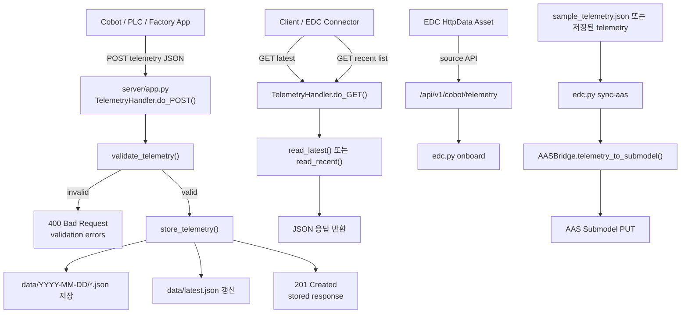

# Catena-X EDC Connector and Cobot AAS Bridge

이 디렉토리는 공장 협동로봇 데이터를 `Catena-X` 데이터 스페이스 스타일로 연결하기 위한 예제 구현을 포함합니다.

## 구성

- `edc.py`: EDC 자산 등록, 정책/계약 정의, 협동로봇 텔레메트리의 AAS Submodel 업서트
- `sample_telemetry.json`: 협동로봇 텔레메트리 예제 입력
- `server/app.py`: 텔레메트리 수신 및 JSON 파일 저장 백엔드

## 서버 흐름도



## 1. 텔레메트리 서버 실행

```bash
python3 /Users/tinyos/devel_opment/BerePi/apps/catenax/server/app.py --host 0.0.0.0 --port 8080
```

기본 엔드포인트:

- `GET /health`
- `POST /api/v1/cobot/telemetry`
- `GET /api/v1/cobot/telemetry/latest`
- `GET /api/v1/cobot/telemetry?limit=20`

저장 위치:

- `/Users/tinyos/devel_opment/BerePi/apps/catenax/server/data/YYYY-MM-DD/*.json`
- 최신 데이터는 `/Users/tinyos/devel_opment/BerePi/apps/catenax/server/data/latest.json`

예제 전송:

```bash
curl -X POST http://localhost:8080/api/v1/cobot/telemetry \
  -H "Content-Type: application/json" \
  --data @/Users/tinyos/devel_opment/BerePi/apps/catenax/sample_telemetry.json
```

## 2. EDC 자산 온보딩

환경변수:

```bash
export CATENAX_EDC_MANAGEMENT_URL="http://localhost:9191/management"
export CATENAX_AAS_BASE_URL="http://localhost:8081/shells/cobot-01"
export CATENAX_AAS_SUBMODEL_ID="urn:uuid:cobot-operational-data-submodel"
export CATENAX_EDC_API_KEY="your-edc-api-key"
export CATENAX_AAS_API_KEY="your-aas-api-key"
```

실행:

```bash
python3 /Users/tinyos/devel_opment/BerePi/apps/catenax/edc.py onboard \
  --asset-id cobot-01-telemetry \
  --provider-bpn BPNL000000000001 \
  --cobot-api-base-url http://localhost:8080
```

기본 데이터 경로는 `/api/v1/cobot/telemetry`이며, 서버 백엔드와 바로 연결됩니다.

## 3. AAS로 동기화

```bash
python3 /Users/tinyos/devel_opment/BerePi/apps/catenax/edc.py sync-aas \
  --telemetry-json /Users/tinyos/devel_opment/BerePi/apps/catenax/sample_telemetry.json
```

## 텔레메트리 필수 필드

- `robot_id`
- `line_id`
- `station_id`
- `cycle_time_ms`
- `power_watts`
- `program_name`
- `status`

선택 필드로 `good_parts`, `reject_parts`, `temperature_c`, `vibration_mm_s`, `pose`, `joint_positions_deg`, `alarms`, `produced_at`를 사용할 수 있습니다.
