# YOLO & Camera 연동 with RPi3 B+

- 재실 감지 시스템
1. RPi에 Camera을 연동하고 YOLO System을 RPi에 설치함
2. Camera로 실시간 상태를 촬영하고 이 사진을 YOLO에 연동하여 object를 detection을 확인
3. capture 사진을 파일이름을 시간으로 저장

## Step1 Camera Test
&nbsp; &nbsp; &nbsp; 터미널 창에서 : vcgencmd get_camera  
&nbsp; </img> 

## Step2 Rpi State
&nbsp; 1. os-release 버전 확인  
&nbsp; &nbsp; &nbsp; 터미널 창에서 : vcgencmd get_camera  
&nbsp; </img> 
&nbsp; 2. rpi_update_upgrade 
&nbsp; &nbsp; &nbsp; 터미널 창에서 : sudo apt-get update  
&nbsp; &nbsp; &nbsp; 터미널 창에서 : sudo apt-get upgrade  
&nbsp; 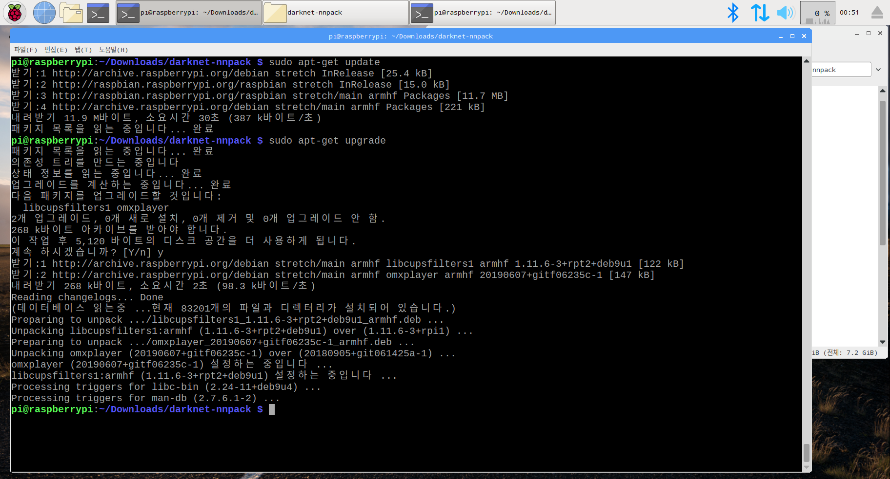</img> 

## Step3 Install required library
&nbsp; 1. PeachPy 설치 
&nbsp; &nbsp; &nbsp; 터미널 창에서 :sudo pip install --upgrade git+https://github.com/Maratyszcza/PeachPy 
&nbsp; 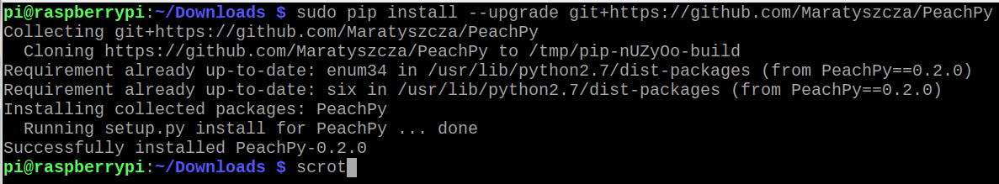</img> 

&nbsp; 2. confu 
&nbsp; 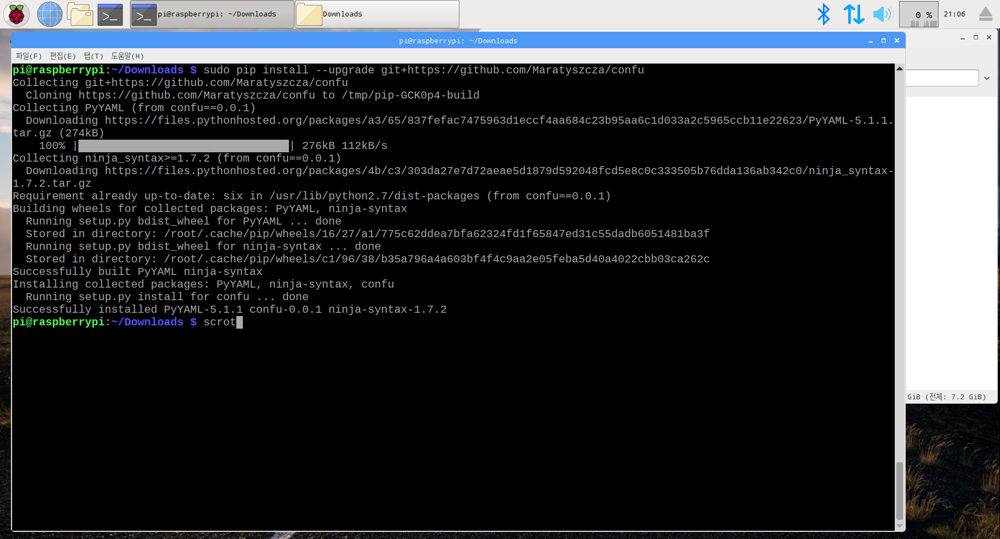</img> 

&nbsp; 3. ninja_git 
&nbsp; 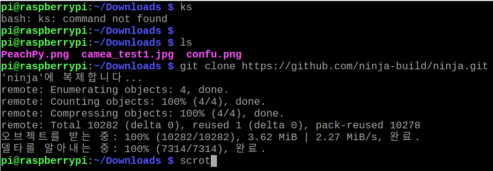</img> 
&nbsp; 4. ninja_install_export 
&nbsp; 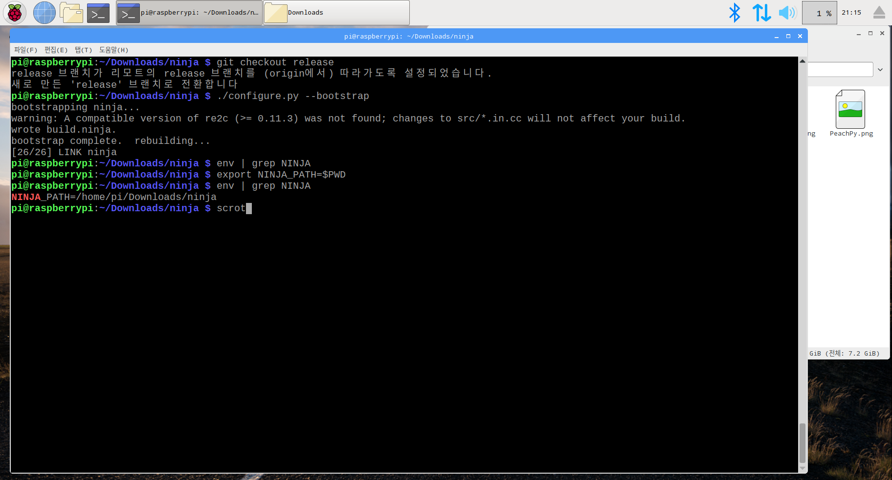</img> 

&nbsp; 5. clang_install 
&nbsp; 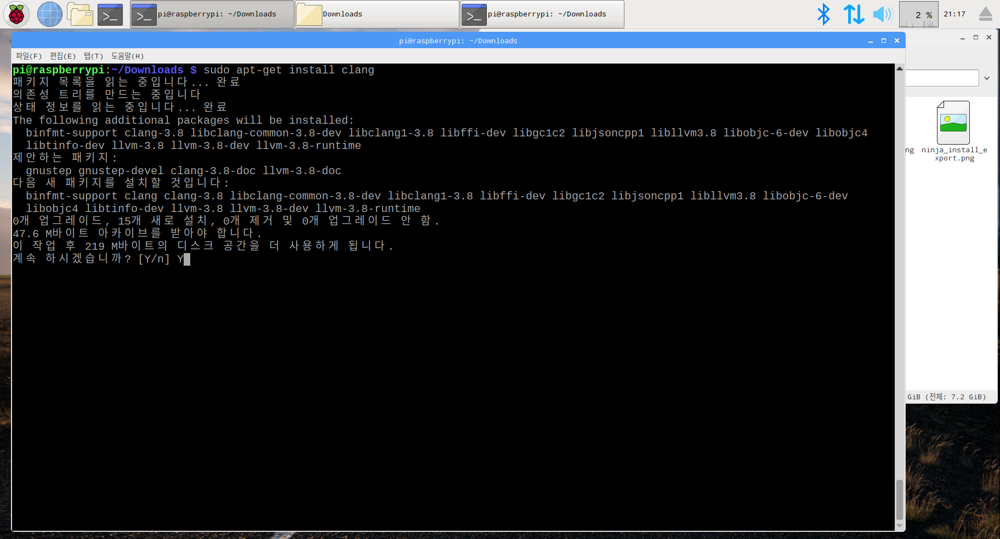</img> 
&nbsp; 5. clang_install_done 
&nbsp; 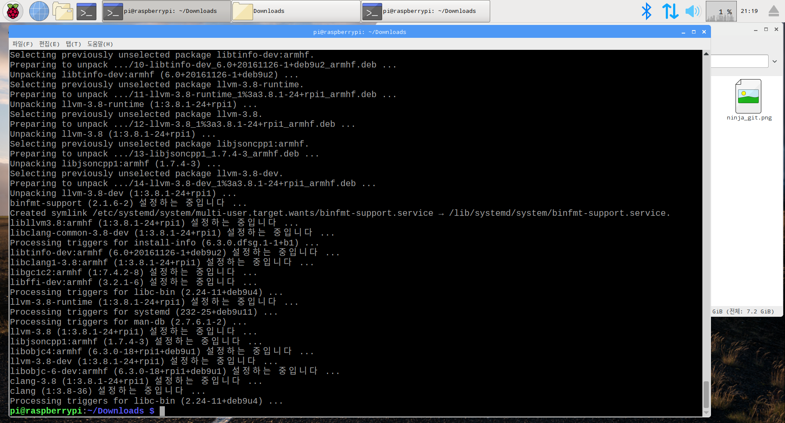</img> 

nnpack-darknet_git 
&nbsp; 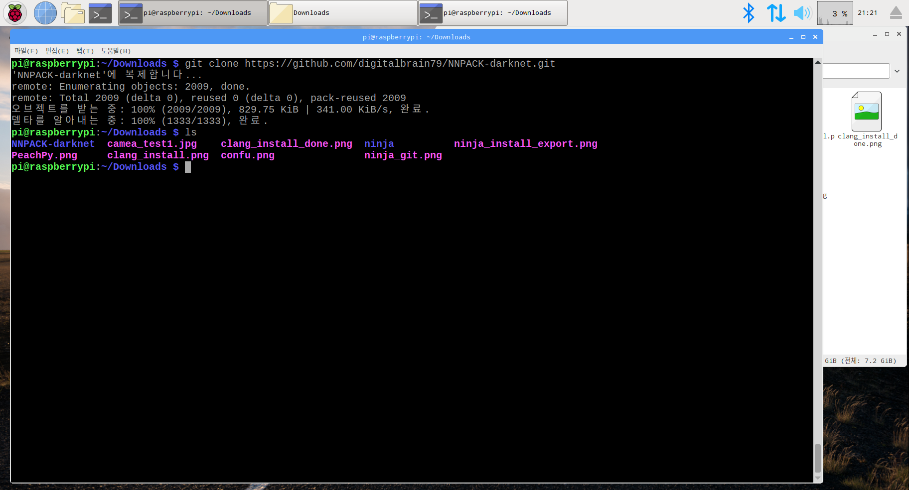</img> 
nnpack-darknet_confu 
&nbsp; 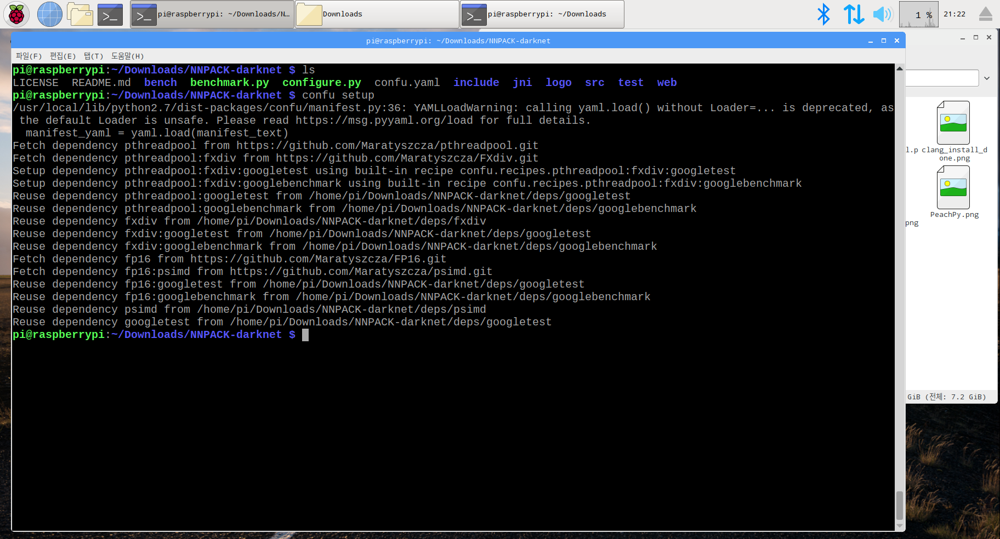</img> 
nnpack-darknet_configure 
&nbsp; 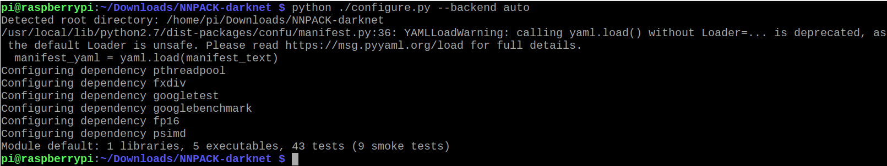</img> 
nnpack-darknet_ninja_1 
&nbsp; 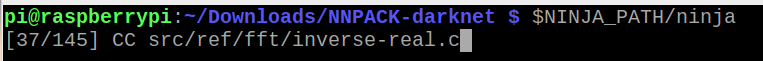</img> 
nnpack-darknet_ninja_2 
&nbsp; 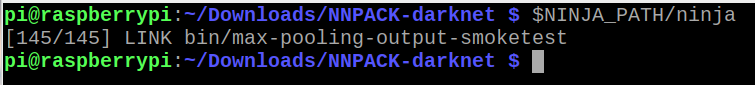</img> 
nnpack-darknet_cp 
&nbsp; 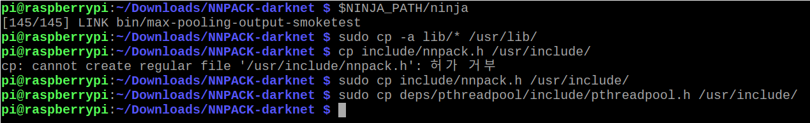</img> 

## Step4 Install darknet_nnpack
darknet_nnpack_git 
&nbsp; 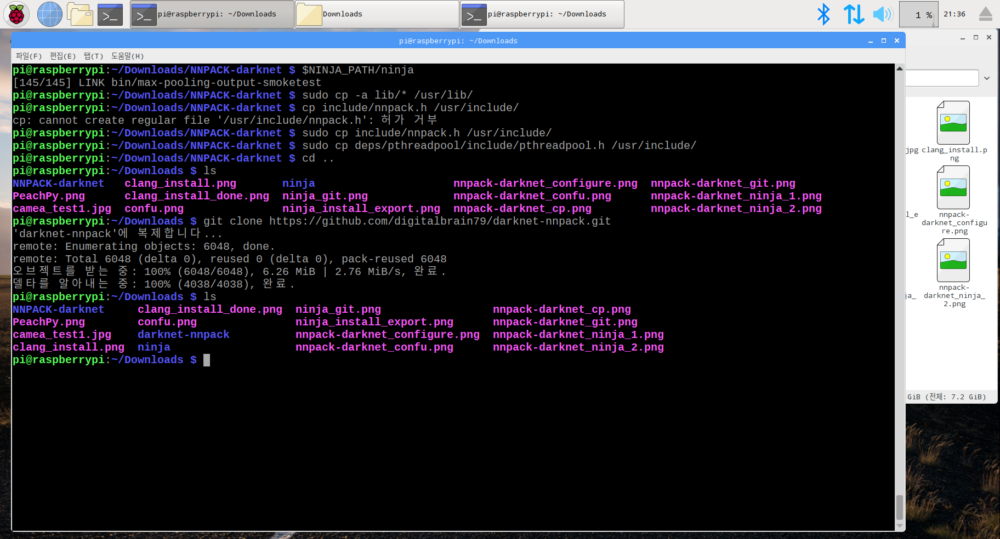</img> 
darknet_nnpack_make1 
&nbsp; 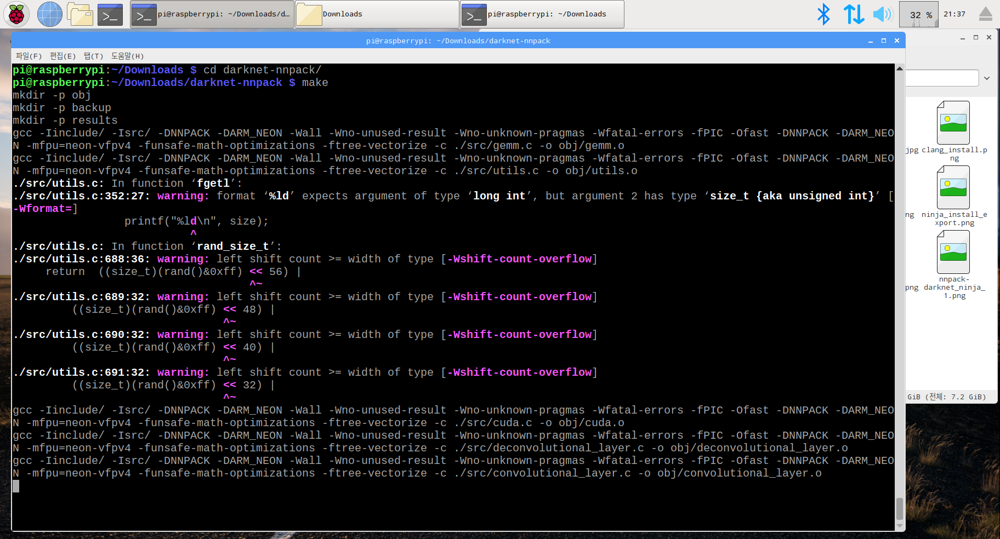</img> 
darknet_nnpack_make2 
&nbsp; 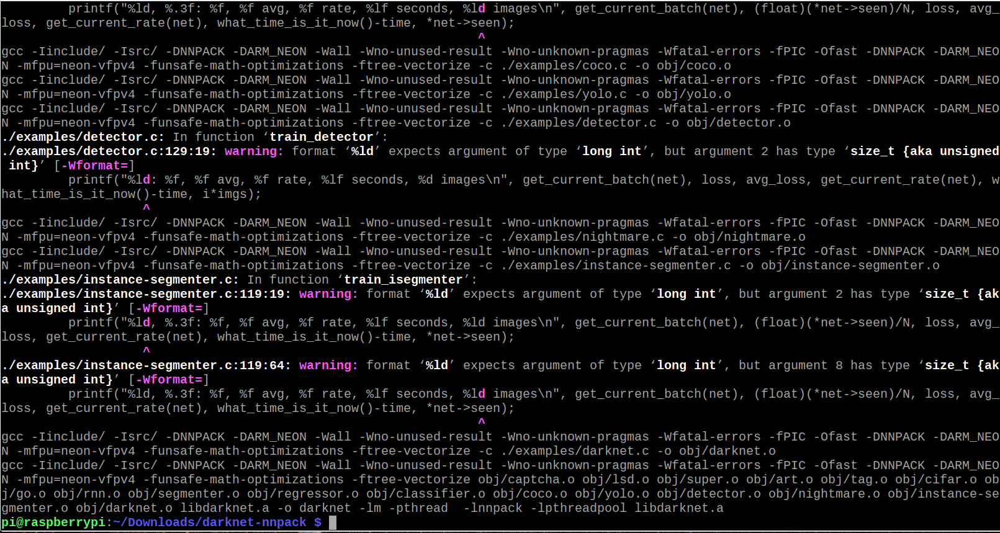</img> 

## Step5 Download yolov file
yolov3_download 
&nbsp; 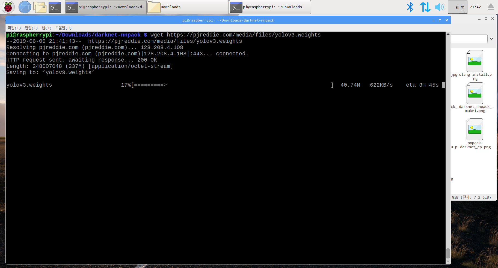</img> 
yolov3_download2 
&nbsp; 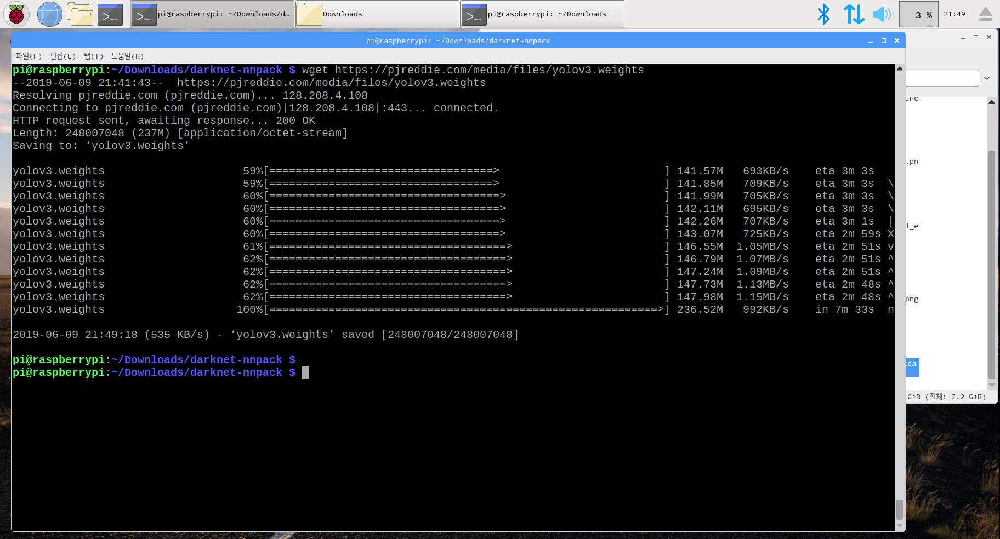</img> 
yolov2-tiny_download 
&nbsp; 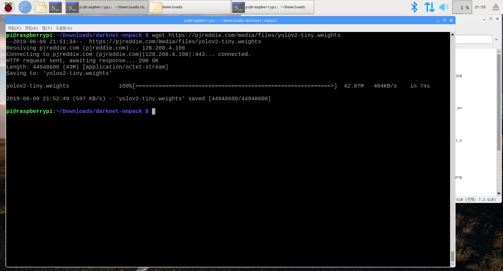</img> 
yolov3-tiny_download 
&nbsp; </img> 

## Step6 Run darknet App
darknet_test_person 
&nbsp; 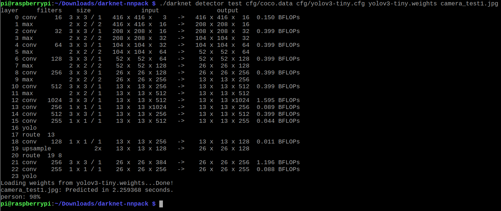</img> 

## Step7 재실감지 시스템
python_run 
&nbsp; 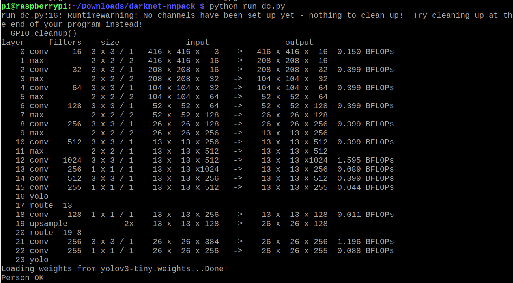</img> 
save_screenshot 
&nbsp; 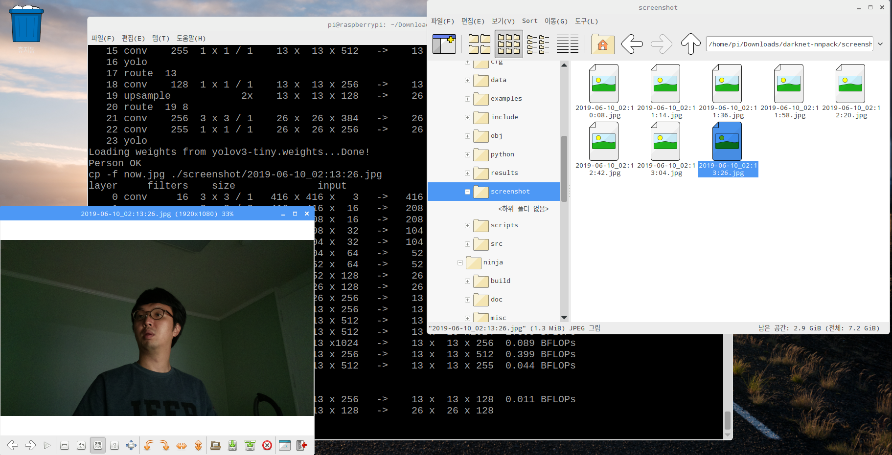</img> 
