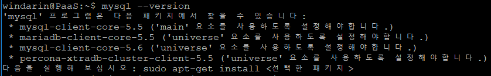

# 구축

# 명령어 
  &nbsp; mysql 버전 상태 확인 : mysql --version  
  &nbsp; mysql port 설정 확인 : cat /etc/mysql/my.cnf | grep port  
  &nbsp; mysql 서비스 상태 확인, 시작, 정지 : service mysql status, start, stop  
  &nbsp; Linux port 상태 확인 : nmap localhost  
  
# 설치 환경
  &nbsp; OS 환경 확인 
  &nbsp; </img> 
  
  &nbsp; 미설치 환경 확인 
  &nbsp; </img> 
  
# 설치 과정
