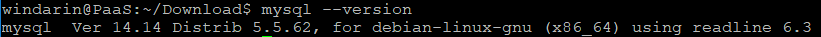
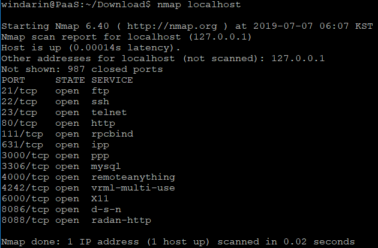
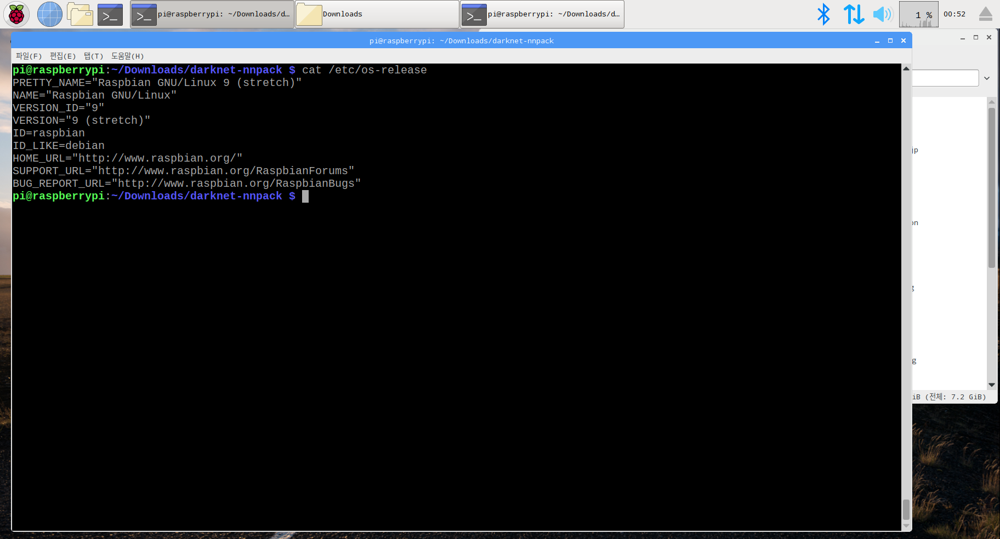

# MySQL 서버 구축

## 명령어 
  &nbsp; mysql 버전 상태 확인 : mysql --version  
  &nbsp; </img> 
    
  &nbsp; mysql 서비스 상태 확인, 시작, 정지 : service mysql status, start, stop  
  
  &nbsp; Linux port 상태 확인 : nmap localhost  
  &nbsp; </img> 
  
## 설치 환경
  &nbsp; OS 환경 확인 
  &nbsp; </img> 
