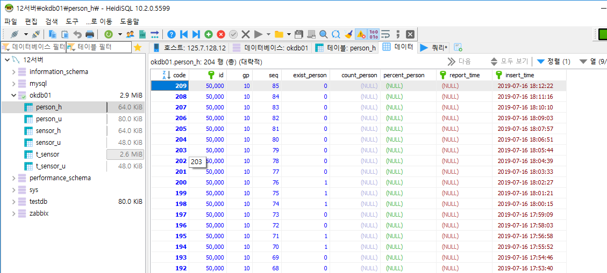
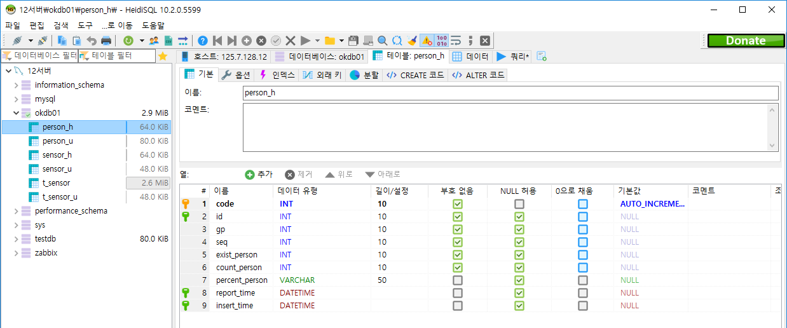

# DataBase 계획
## 정보
  &nbsp; IP : 125.7.128.12 
  &nbsp; Port : 53306 
  &nbsp; ID : root 
  &nbsp; </img> 

## Database Table 종류 
  &nbsp; person_h : 사람 유무 히스토리 테이블 
  &nbsp; person_u : 사람 유무 업데이트 테이블 
  &nbsp; </img> 
  
## Column
이름 | 설명
:----|:----
exist_person  | 사람 유무  
count_person  | 사람 숫자  
percent_person | 확률 수치  
report_time  | 사진 찍힌 시간  
insert_time  | DB insert 시간  
  &nbsp; </img> 

## Row
   &nbsp; 1분에 한번 분석 
