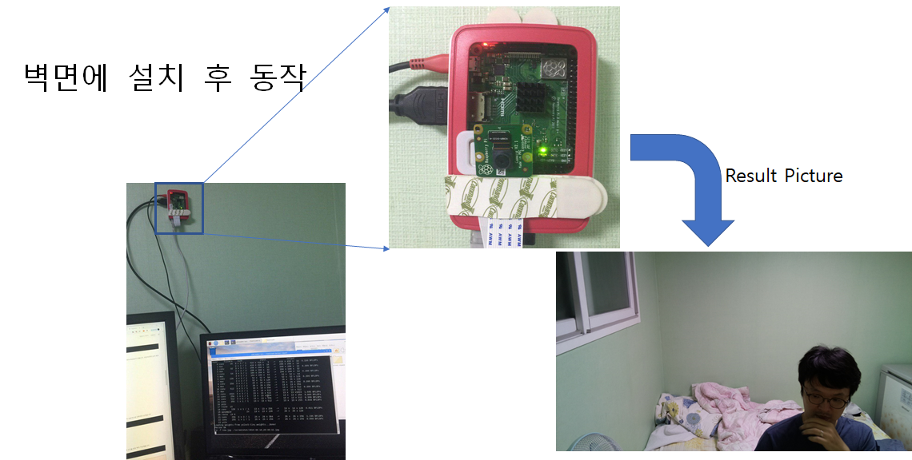
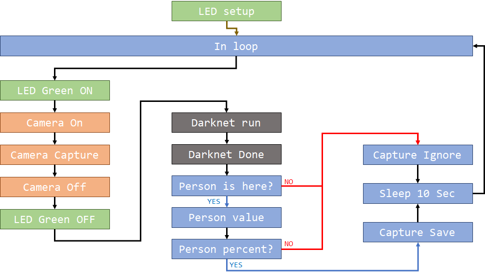
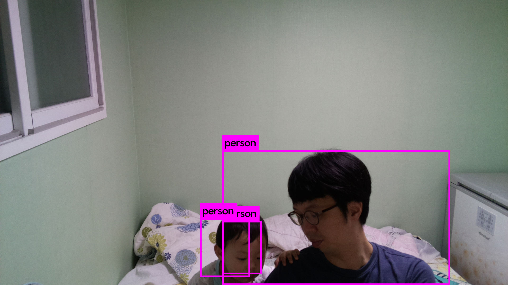
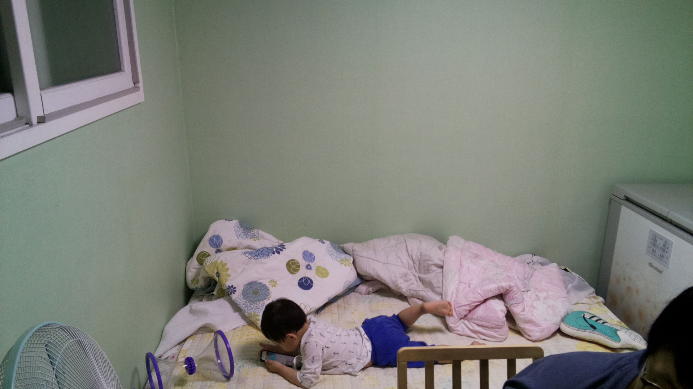
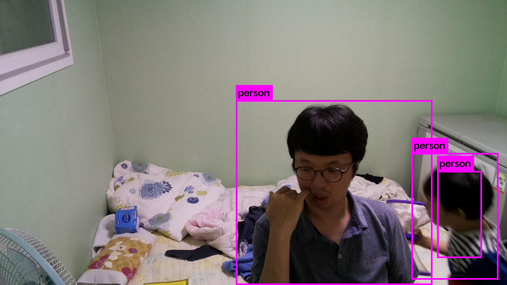
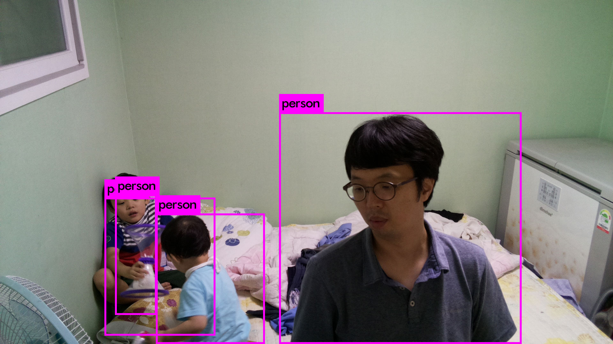
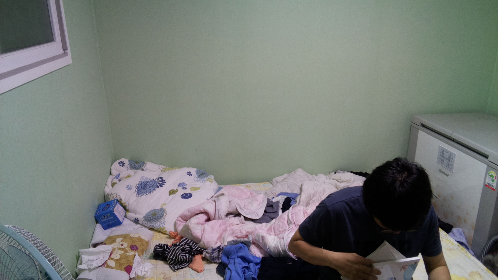
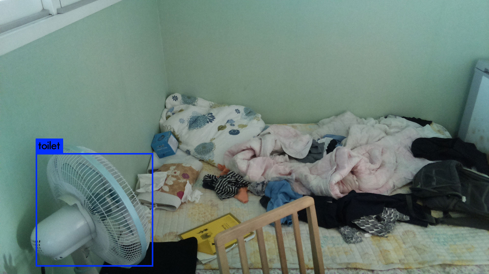
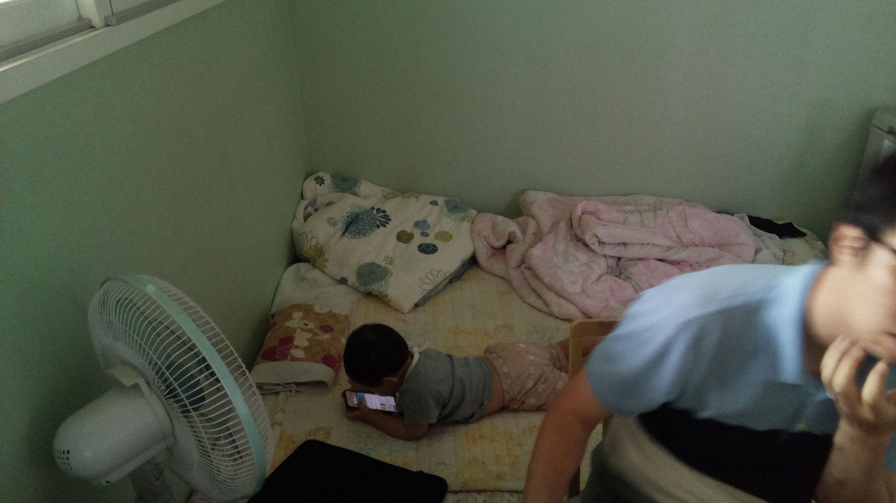

# RPI 3B+ install Darknet-nnpack 

## 설치 참고 링크
  [darknet-nnpack](https://github.com/digitalbrain79/darknet-nnpack) 
  [Raspberry pi YOLO Real-time Object Detection](http://raspberrypi4u.blogspot.com/2018/10/raspberry-pi-yolo-real-time-object.html) 
  [카메라 추가 테스트](https://webnautes.tistory.com/929) 
  
## YOLO와 Camera 연동
  ### Test 환경 
  &nbsp; </img> 
  ### run_dc.py program flow 
  &nbsp; </img> 
  
## 설치 설명 파일
  [설치&동작 설명파일 InstallRun.md](https://github.com/jeonghoonkang/BerePi/blob/master/apps/deeplearning/darknet-rpi/InstallRun.md)
    
## 오류 리포트
  1. -- 정면은 잘 찾음 
  &nbsp; </img> 
  &nbsp; -- 현재 24개월 유아는 옆모습은 못찾음 
  &nbsp; </img> 
  &nbsp; -- 1 
  &nbsp; </img> 
  &nbsp; -- 2 
  &nbsp; </img> 
  &nbsp; -- 3 
  &nbsp; </img> 
  &nbsp; -- 4 
  &nbsp; </img> 
  &nbsp; -- 5 
  &nbsp; </img> 
  
  
## 기타 
