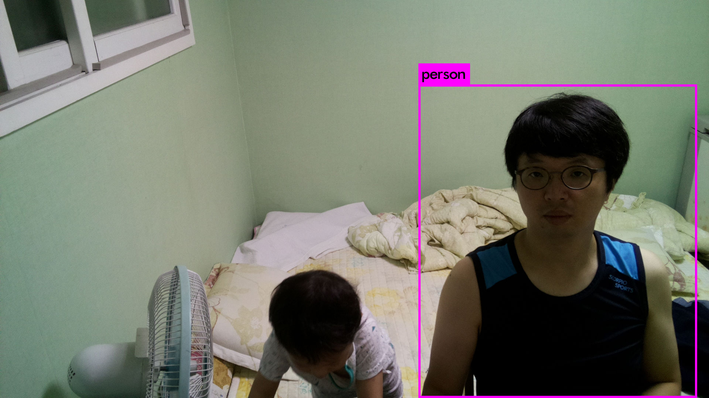
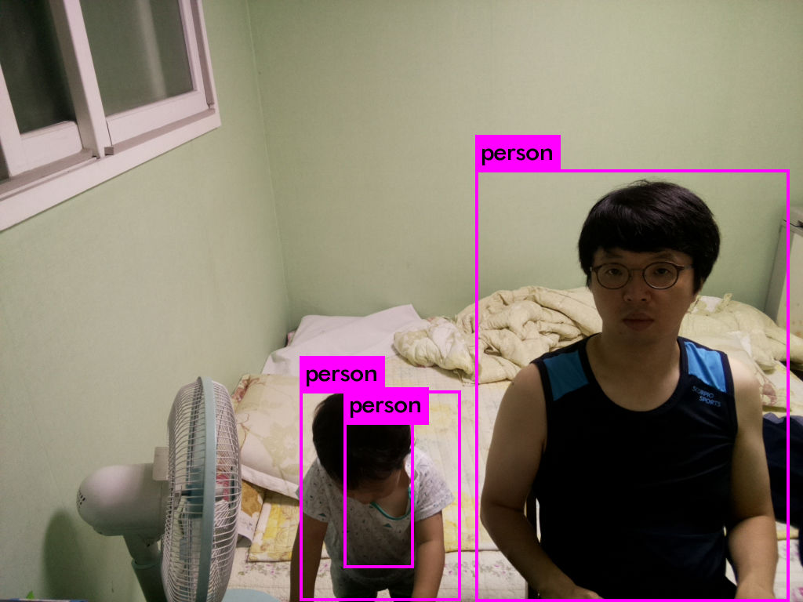
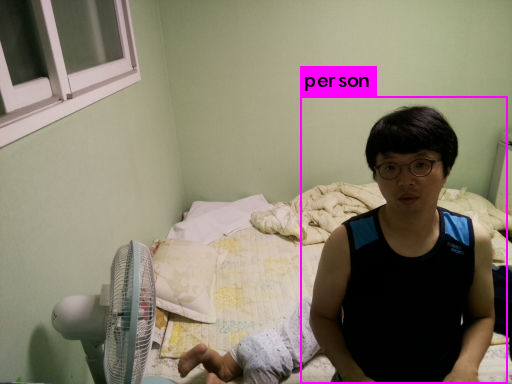

# 분석 속도 테스트

## 기본 속도
  &nbsp; 사진 크기 1920x1080  
  &nbsp; Predicted in 2.100221 seconds. 
  &nbsp; </img> 
  &nbsp; [결과 시간 TXT](base_run(1920-1080).txt) 
  
## 사진 크기에 따른 시간 1
  &nbsp; 사진 크기 1024x768  
  &nbsp; Predicted in 1.763413 seconds. 
  &nbsp; </img> 
  &nbsp; [결과 시간 TXT](size_run(1024-768).txt) 

## 사진 크기에 따른 시간 2
  &nbsp; 사진 크기 512x384  
  &nbsp; Predicted in 1.707834 seconds. 
  &nbsp; </img> 
  &nbsp; [결과 시간 TXT](size_run(512-384.txt)) 
