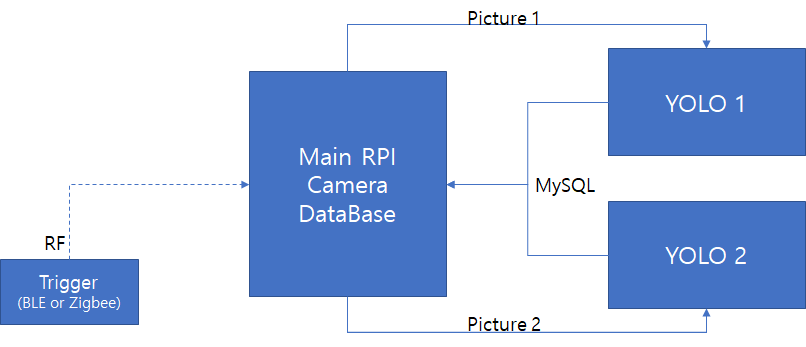
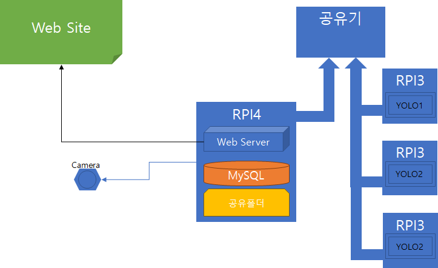
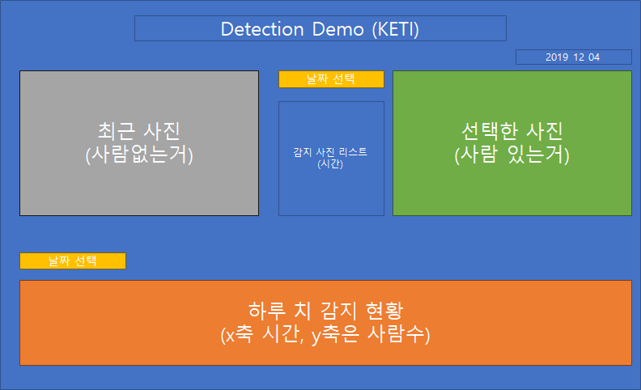

### Human Detection Demo. 시스템

#### 목표 데모 시스템 동작절차
1. 사람 감지하면, 카메라 촬영
2. 영상 전송
3. 영상 디텍션, 결과 연산
4. 결과 DB 저장
5. 결과 GUI 출력

#### 결과 화면
1. 측정 사진 영상
2. 연산결과 사진 (Box) 영상 출력
4. 해당 결과를 DB에 입력하고, 사용 숫자를 그래프로 출력

#### 1단계 데모 구현 방안 
- 데모 시스템 초기 구현에서 우선적으로 동작 테스트를 진행할 수 있는 방법으로 구성 
&nbsp; </img> 

1. 데모용 Trigger 제작
- RPI로 데모를 동작시키면 딜레이가 발생하기 때문에 BLE나 zigbee 버튼 모듈로 버튼을 누르면 데모 1루프 실행
- 무언가 감지된 순간 사진을 찍는식 
- 오브젝트 디텍션하는 시간이 5초라면, 5초마다 지속적으로 사진을 계속해서 찍고 있으면 되지 않을까?

2. 여러장 촬영 후  2개의 RIP 영상분석
- 사진을 0.5초 단위로 2장 찍고 2장을 분석후 데이터 사진을 종합하여 DB에 저장
- 결과를 GUI로 출력

#### 시스템 구성 및 동작

&nbsp; </img> 

1. RPI4의 카메라 촬영횟수 
  - 3/RPI3갯수 (ex : 3/3 = 1sec) 

2. 시스템 동작 절차
  <pre>
  1 RPI4가 사진 획득
    1-1 P1생성(공유폴더 in RPI4)
    1-2 RPI3(YOLO1)이 분석
    1-3 결과 저장(Mysql in RPI4)
    1-4 R1생성(공유폴더 in RPI4) & P1삭제
    2-1 P2생성(공유폴더 in RPI4)
    .........
    2-4 R2생성(공유폴더 in RPI4) & P2삭제
    3-1 P3생성(공유폴더 in RPI4)
    .........
    3-4 R3생성(공유폴더 in RPI4) & P3삭제
  </pre>
3. web site 기능
  - 현재 사진 
  - 최근 감지 사진 
  - 리스트 (날짜별 감지 현황) 
  - 차트 (날짜별 감지 현황) 

#### GUI 초안
&nbsp; </img> 

#### 진행 현황
  - 2019-12-05 
    - RPI4 Server Settnig Done
    - RPI4 MySQL Setting Done
    - RPI4 Samba Setting Fail(Static IP Need)
    - GUI 구성 스타트
    
  - 2019-12-06 
    - GUI 테스트 
&nbsp; </img> 
    
#### 기타
 - [오경컴텍 ORC용 카메라에 연동 테스트](https://github.com/OKCOMTECH/OK_DEV_LABORATORY/tree/master/PCRS/Camera)
