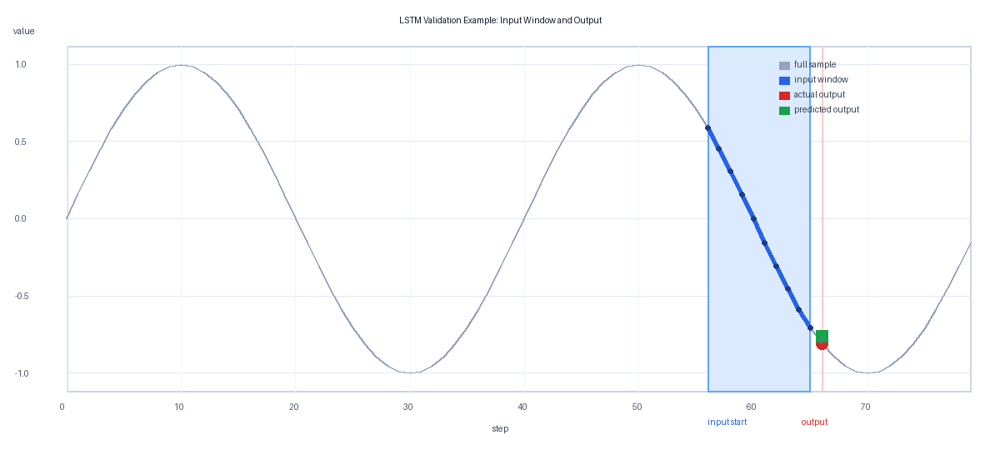
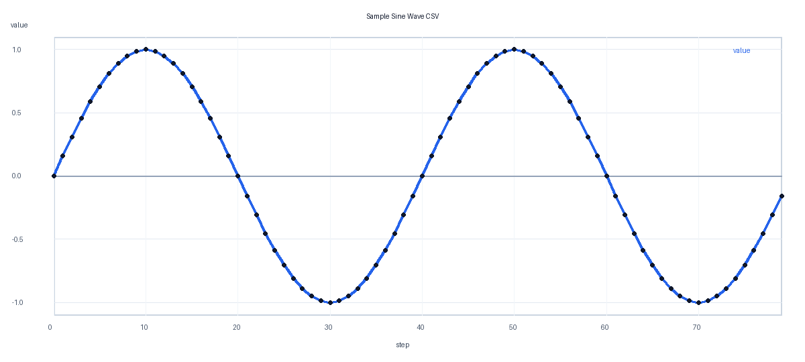

# LSTM Sample

이 디렉토리는 작은 시계열 데이터를 이용해 LSTM(Long Short-Term Memory) 모델을 학습하고 검증하는 예제입니다. 기본 예제는 `data/sample_sine.csv`의 `value` 컬럼을 보고 다음 시점의 값을 예측합니다.

## 파일 구성

- `data/sample_sine.csv`: 학습 샘플용 사인파 시계열 CSV
- `assets/sample_sine.png`: 샘플 사인파 CSV 그래프 이미지
- `train.py`: LSTM 모델 학습 코드
- `validate.py`: 저장된 체크포인트 검증 코드와 입력/출력 구간 그래프 생성 코드
- `requirements.txt`: 실행에 필요한 Python 패키지
- `checkpoints/`: 학습된 모델 체크포인트 저장 위치

## 실행 방법

```bash
cd apps/deeplearning/models/LSTM
python3 -m venv .venv
source .venv/bin/activate
pip install -r requirements.txt
python train.py
python validate.py
```

기본 실행은 다음 파일을 생성합니다.

```text
checkpoints/lstm_sample.pt
```

다른 CSV를 사용할 때는 `value`처럼 예측 대상이 되는 숫자 컬럼을 지정합니다.

```bash
python train.py --data data/my_timeseries.csv --value-column Global_active_power
python validate.py --data data/my_timeseries.csv --checkpoint checkpoints/lstm_sample.pt
```

검증을 실행하면 기본적으로 다음 그래프도 생성됩니다.

```text
assets/lstm_validation_prediction.png
```

이 이미지는 검증에 사용된 입력 구간을 파란색으로 표시하고, 해당 입력으로 예측한 출력 위치를 실제값은 빨간색, 예측값은 초록색으로 표시합니다.

```bash
python validate.py --plot-index 0 --plot-output assets/lstm_validation_prediction.png
```

예제 이미지는 다음과 같습니다.



## LSTM 원리

LSTM은 RNN(Recurrent Neural Network)의 한 종류입니다. 일반 RNN은 과거 정보를 순서대로 전달하지만, 시퀀스가 길어지면 오래된 정보가 학습 중에 약해지는 문제가 있습니다. LSTM은 이 문제를 줄이기 위해 셀 상태(cell state)와 게이트(gate)를 사용합니다.

- Forget gate: 이전 셀 상태에서 버릴 정보를 결정합니다.
- Input gate: 현재 입력에서 새로 기억할 정보를 결정합니다.
- Cell state: 긴 시퀀스 동안 유지되는 장기 기억 통로입니다.
- Output gate: 현재 시점의 출력으로 내보낼 정보를 결정합니다.

이 구조 덕분에 LSTM은 주가, 센서값, 전력 사용량, 로그 지표, 자연어처럼 순서와 과거 맥락이 중요한 데이터에 자주 사용됩니다. 이 예제에서는 최근 `sequence-length`개의 값을 입력으로 받아 다음 1개 값을 예측합니다.

## 샘플 데이터 형식

`train.py`와 `validate.py`는 다음처럼 헤더가 있는 CSV를 읽습니다.

```csv
step,value
0,0.0000
1,0.1564
2,0.3090
```

학습 스크립트는 지정한 컬럼을 min-max 정규화한 뒤, 길이 `sequence-length`의 윈도우를 만들어 다음 값을 정답으로 학습합니다.

## 기본 샘플 데이터 그래프

아래 이미지는 `data/sample_sine.csv`의 `step`과 `value` 컬럼을 시각화한 그래프입니다.



## 테스트용 데이터 다운로드 방법

더 큰 시계열 데이터로 테스트하려면 UCI Machine Learning Repository의 Individual Household Electric Power Consumption 데이터셋을 사용할 수 있습니다. 이 데이터셋은 약 4년 동안 1분 단위로 측정한 가정 전력 사용량 데이터이며, UCI 페이지에서 `Download` 버튼 또는 `ucimlrepo` 패키지로 받을 수 있습니다.

### 방법 1: UCI Python 패키지 사용

```bash
pip install ucimlrepo pandas
python - <<'PY'
from ucimlrepo import fetch_ucirepo

dataset = fetch_ucirepo(id=235)
features = dataset.data.features
features[["Global_active_power"]].dropna().head(5000).to_csv(
    "data/household_power_sample.csv",
    index=False,
)
print("saved: data/household_power_sample.csv")
PY
```

생성한 CSV로 학습하려면 다음처럼 실행합니다.

```bash
python train.py --data data/household_power_sample.csv --value-column Global_active_power --epochs 100
python validate.py --data data/household_power_sample.csv
```

### 방법 2: UCI 웹 페이지에서 직접 다운로드

1. UCI 데이터셋 페이지로 이동합니다: https://archive.ics.uci.edu/dataset/235/individual%2Bhousehold%2Belectric%2Bpower%2Bconsumption
2. `Download` 버튼으로 압축 파일을 받습니다.
3. 압축을 풀고 `household_power_consumption.txt`를 확인합니다.
4. 세미콜론 구분 파일이므로, 필요한 컬럼만 CSV로 변환한 뒤 `--data`와 `--value-column`에 지정합니다.

예시 변환 코드:

```bash
python - <<'PY'
import csv

source = "household_power_consumption.txt"
target = "data/household_power_sample.csv"

with open(source, "r", newline="") as src, open(target, "w", newline="") as dst:
    reader = csv.DictReader(src, delimiter=";")
    writer = csv.DictWriter(dst, fieldnames=["Global_active_power"])
    writer.writeheader()
    count = 0
    for row in reader:
        value = row.get("Global_active_power", "").strip()
        if value and value != "?":
            writer.writerow({"Global_active_power": value})
            count += 1
        if count >= 5000:
            break

print(f"saved: {target}")
PY
```

## 참고

- UCI Individual Household Electric Power Consumption: https://archive.ics.uci.edu/dataset/235/individual%2Bhousehold%2Belectric%2Bpower%2Bconsumption
