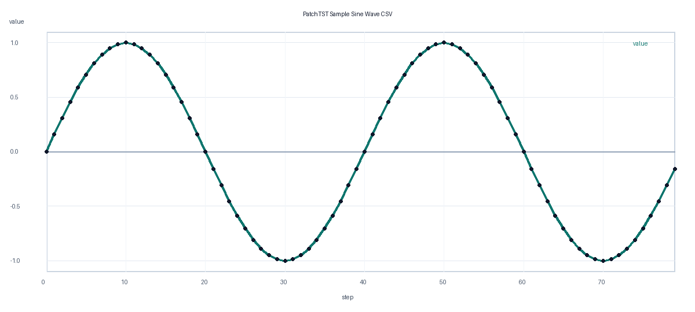

# PatchTST Sample

이 디렉토리는 PatchTST 방식으로 단변량 시계열의 다음 값을 예측하는 예제입니다. 실행 흐름은 `../LSTM` 예제와 같고, 모델 구조만 LSTM 대신 patch 기반 Transformer encoder를 사용합니다.

## 파일 구성

- `data/sample_sine.csv`: 학습 샘플용 사인파 시계열 CSV
- `assets/sample_sine.png`: 학습 샘플 데이터 그래프 이미지
- `train.py`: PatchTST 모델 학습 코드
- `validate.py`: 저장된 체크포인트 검증 코드
- `requirements.txt`: 실행에 필요한 Python 패키지
- `checkpoints/`: 학습된 모델 체크포인트 저장 위치

## 실행 방법

```bash
cd apps/deeplearning/models/patchTST
python3 -m venv .venv
source .venv/bin/activate
pip install -r requirements.txt
python train.py
python validate.py
```

기본 실행은 다음 파일을 생성합니다.

```text
checkpoints/patchtst_sample.pt
```

다른 CSV를 사용할 때는 예측 대상이 되는 숫자 컬럼을 지정합니다.

```bash
python train.py --data data/my_timeseries.csv --value-column Global_active_power
python validate.py --data data/my_timeseries.csv --checkpoint checkpoints/patchtst_sample.pt
```

## 학습 샘플 데이터 그래프

아래 이미지는 기본 학습 데이터인 `data/sample_sine.csv`의 `step`과 `value` 컬럼을 시각화한 그래프입니다.



## PatchTST 원리

PatchTST는 시계열을 개별 시점 하나씩 처리하지 않고, 일정 길이의 patch로 나눈 뒤 Transformer encoder에 넣는 방식입니다. 이 예제에서는 최근 `sequence-length`개의 값을 입력으로 받고, `patch-length` 크기의 겹치는 patch를 `stride` 간격으로 생성합니다.

처리 흐름은 다음과 같습니다.

1. 입력 시계열을 sliding window로 잘라 학습 샘플을 만듭니다.
2. 각 입력 윈도우를 여러 개의 patch로 분할합니다.
3. 각 patch를 `d-model` 차원의 token으로 projection합니다.
4. 위치 임베딩을 더한 뒤 Transformer encoder로 patch 사이의 관계를 학습합니다.
5. encoder 출력 전체를 펼쳐 다음 시점의 값을 회귀 예측합니다.

PatchTST는 긴 시계열에서 지역 패턴을 patch 단위로 압축해 Transformer가 더 효율적으로 시간 의존성을 볼 수 있게 해줍니다.

## 주요 옵션

- `--sequence-length`: 모델 입력으로 사용할 과거 값 개수
- `--patch-length`: 하나의 patch에 들어가는 값 개수
- `--stride`: patch를 이동시키는 간격
- `--d-model`: Transformer token 차원
- `--nhead`: multi-head attention head 개수
- `--num-layers`: Transformer encoder layer 개수
- `--dim-feedforward`: encoder 내부 feed-forward 차원

예시:

```bash
python train.py --sequence-length 32 --patch-length 8 --stride 4 --epochs 100
python validate.py
```
