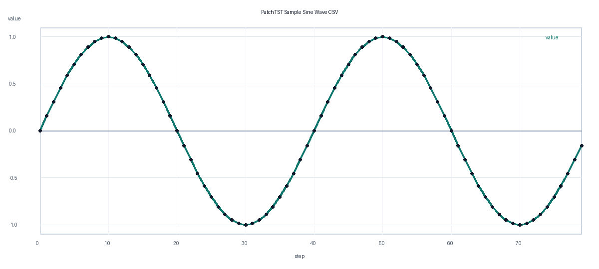
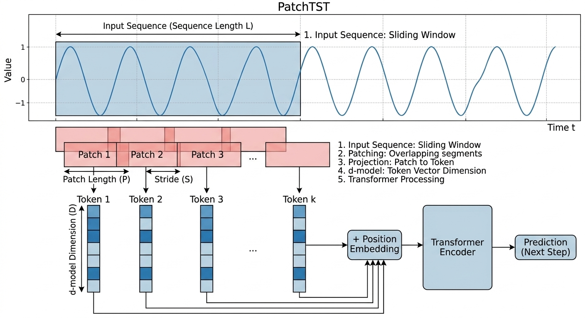

# PatchTST Sample

이 디렉토리는 PatchTST 방식으로 단변량 시계열의 다음 값을 예측하는 예제입니다. 실행 흐름은 `../LSTM` 예제와 같고, 모델 구조만 LSTM 대신 patch 기반 Transformer encoder를 사용합니다.

## 파일 구성

- `data/sample_sine.csv`: 학습 샘플용 사인파 시계열 CSV
- `assets/sample_sine.png`: 학습 샘플 데이터 그래프 이미지
- `train.py`: PatchTST 모델 학습 코드
- `validate.py`: 저장된 체크포인트 검증 코드
- `requirements.txt`: 실행에 필요한 Python 패키지
- `checkpoints/`: 학습된 모델 체크포인트 저장 위치

## 실행 방법

```bash
cd apps/deeplearning/models/patchTST
python3 -m venv .venv
source .venv/bin/activate
pip install -r requirements.txt
python train.py
python validate.py
```

기본 실행은 다음 파일을 생성합니다.

```text
checkpoints/patchtst_sample.pt
```

다른 CSV를 사용할 때는 예측 대상이 되는 숫자 컬럼을 지정합니다.

```bash
python train.py --data data/my_timeseries.csv --value-column Global_active_power
python validate.py --data data/my_timeseries.csv --checkpoint checkpoints/patchtst_sample.pt
```

## 학습 샘플 데이터 그래프

아래 이미지는 기본 학습 데이터인 `data/sample_sine.csv`의 `step`과 `value` 컬럼을 시각화한 그래프입니다.



## PatchTST 원리

PatchTST는 시계열을 개별 시점 하나씩 처리하지 않고, 일정 길이의 patch로 나눈 뒤 Transformer encoder에 넣는 방식입니다. 이 예제에서는 최근 `sequence-length`개의 값을 입력으로 받고, `patch-length` 크기의 겹치는 patch를 `stride` 간격으로 생성합니다.

처리 흐름은 다음과 같습니다.

1. 입력 시계열을 sliding window로 잘라 학습 샘플을 만듭니다.
2. 각 입력 윈도우를 여러 개의 patch로 분할합니다.
3. 각 patch를 `d-model` 차원의 token으로 projection합니다.
4. 위치 임베딩을 더한 뒤 Transformer encoder로 patch 사이의 관계를 학습합니다.
5. encoder 출력 전체를 펼쳐 다음 시점의 값을 회귀 예측합니다.

PatchTST는 긴 시계열에서 지역 패턴을 patch 단위로 압축해 Transformer가 더 효율적으로 시간 의존성을 볼 수 있게 해줍니다.

## 주요 옵션

- `--sequence-length`: 모델 입력으로 사용할 과거 값 개수
- `--patch-length`: 하나의 patch에 들어가는 값 개수
- `--stride`: patch를 이동시키는 간격
- `--d-model`: Transformer token 차원
- `--nhead`: multi-head attention head 개수
- `--num-layers`: Transformer encoder layer 개수
- `--dim-feedforward`: encoder 내부 feed-forward 차원

예시:

```bash
python train.py --sequence-length 32 --patch-length 8 --stride 4 --epochs 100
python validate.py
```

## PatchTST 구조 이미지




## 실습 개요: 과거의 흐름으로 다음 값 예측하기

이 예제는 **최근 24개의 시계열 값을 보고, 바로 다음 시점의 값 1개를 예측**합니다. 사인파가 올라가고 내려가는 패턴을 학습하며, 숫자를 예측하는 **회귀 문제**입니다.

> **입력:** 과거 값 24개 → **모델:** PatchTST 방식의 Transformer → **출력:** 다음 값 1개

### 제공 데이터

- **파일:** `data/sample_sine.csv`
- **내용:** 시간 순서대로 기록된 사인파 값 80개
- **열 구성:** `step`은 시점 번호, `value`는 해당 시점의 값입니다. 모델에는 `value`만 입력합니다.
- **샘플 구성:** 연속된 24개 값을 입력으로, 그다음 값을 정답으로 묶습니다. 예를 들어 `step 0~23`을 보고 `step 24`의 값을 예측합니다.
- **학습·검증:** 기본 설정에서는 총 56개 샘플 중 앞의 44개로 학습하고, 뒤의 12개로 검증합니다.

### 모델은 어떻게 학습하나요?

24개 값을 **6개씩 묶은 작은 구간(Patch)**으로 나눕니다. 구간을 3칸씩 이동하면 서로 겹치는 Patch 7개가 만들어집니다.

각 Patch를 특징 벡터로 바꾸고 순서 정보를 더한 뒤, Transformer가 구간 사이의 관계를 학습합니다. 마지막에는 학습한 특징을 모아 다음 시점의 값 하나를 출력합니다.

| 항목 | 기본 설정 |
| --- | --- |
| 입력 길이 | 과거 값 24개 |
| Patch 구성 | 길이 6, 이동 간격 3, 총 7개 |
| Transformer | 특징 벡터 64차원, Attention Head 4개, Encoder 2층 |
| 학습 방법 | MSE 손실 함수, AdamW, 300 epoch |
| 출력 | 다음 시점의 예측값 1개 |

### 실습할 일

1. **데이터 준비:** 사인파 값을 0~1 범위로 정규화하고, 입력 24개와 정답 1개로 구성된 샘플을 만듭니다.
2. **모델 학습:** `train.py`를 실행해 예측값과 정답의 차이가 줄어들도록 학습합니다.
3. **모델 저장:** 학습한 모델과 설정을 `checkpoints/patchtst_sample.pt`에 저장합니다.
4. **결과 확인:** `validate.py`에서 저장된 모델을 불러와 검증 데이터의 실제값과 예측값을 비교합니다.

### 결과에서 무엇을 확인하나요?

- **학습 중:** 출력되는 `train_mse`가 전반적으로 감소하는지 확인합니다.
- **검증 후:** `mse`, `rmse`, `mae`로 예측 오차를 확인합니다. 값이 작을수록 정답에 가깝습니다.
- **예측값 비교:** `actual`과 `predicted`를 나란히 읽으며, 사인파의 상승·하강 패턴을 따라가는지 살펴봅니다. 기본 출력은 검증 샘플 중 처음 10개입니다.

오차 지표는 **정규화된 값 기준**이며, `actual`과 `predicted`는 **원래 값의 범위로 복원**되어 출력됩니다.

> 이 예제의 핵심은 **시계열을 Patch로 묶고, 구간 사이의 관계를 학습해 다음 값을 예측하는 과정**을 이해하는 것입니다. 현재 코드는 전체 데이터의 최솟값·최댓값으로 정규화합니다. 실제 데이터의 예측 성능을 평가할 때는 학습 구간에서만 정규화 기준을 구한 뒤 검증 구간에 적용해야 합니다.

<!-- 작성 기준: https://github.com/jeonghoonkang/BerePi/tree/495b778bcca81c42cfae2e7e4759d2e6bfad9ecc/apps/deeplearning/models/patchTST -->
