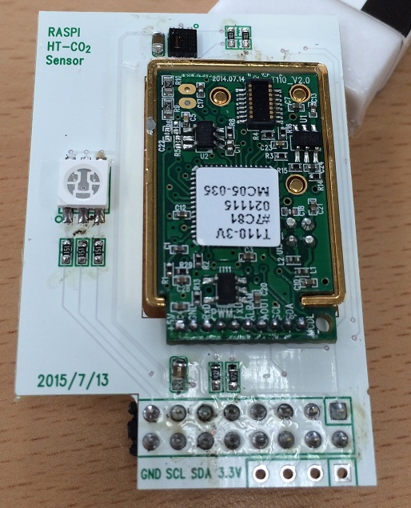

# InfluxDB

## 하드웨어


## 설치

### 1) I2C tools 설치

```
sudo apt-get update && sudo apt-get instlal python-smbus i2c-tools
```

### 2) raspi-config 를 사용해서 I2C 사용하기

```
sudo raspi-config
```
8.Advanced Options > A7.I2C > YES > YEs
and reboot!

### 3) 시스템에서 I2C 모듈을 사용할 수 있도록 설정을 수정
 
```
sudo vim /etc/modules
```
다음 2줄을 파일 마지막에 추가
```
i2c-bcm2708
i2c-dev
```
수정된 파일이 아래와 같은지 확인


```
sudo vim /etc/modprobe.d/raspi-blacklist.conf
```
다음 2줄을 파일 마지막에 추가
```
blacklist spi-bcm2708
blacklist i2c-bcm2708
```
수정된 파일이 아래와 같은지 확인


## 실행

```
sudo python inBerePi.py
```

* [참고자료]()
