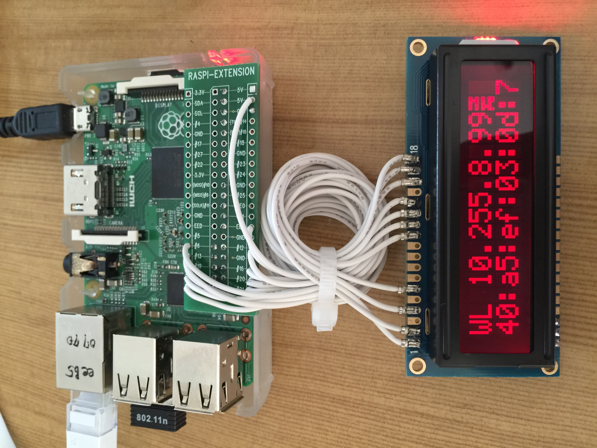

 - Introduciton
   - Raspi LCD driver
   - It shows IP address, stalk channel 
   - sample application
    - 16x2_LCD_RGB.py
    - ip_addr.py
 - How to run the code
   - **sudo python OOO.py**
 - Run result
  - 

#### Wiring info, please see the source code, [ lcd_connect.py](https://github.com/jeonghoonkang/BerePi/blob/master/apps/lcd_berepi/lcd_connect.py)

| LCD pin | Function | RPi GPIO |
|---|---|---|
|01 |GND |GND |
|02 |+5V |+5V |
|03 |Contrast |GND |
|04 |RS |GPIO 6 on raspi2 |
|05 |RW |GND |
|06 |E |GPIO 13 on raspi2 |
|07 |Data 0 | |
|08 |Data 1 | |
|09 |Data 2 | |
|10 |Data 3 | |
|11 |Data 4 |GPIO 19 on raspi2|
|12 |Data 5 |GPIO 26 on raspi2|
|13 |Data 6 |GPIO 21 on raspi2|
|14 |Data 7 |GPIO 20 on raspi2|
|15 |+5V |+5V |
|16 |-R/red |GPIO 16 on raspi2|
|17 |-G/green |GPIO 12 on raspi2|
|18 |-B/blue |GPIO 7 on raspi2|
