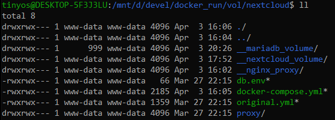

WSL2 에서 파일 생성, 디렉토리 변경 등이 동작하지 않는 경우  

## 사용방법
- sudo umount /mnt/c
- sudo mount -t drvfs d: /mnt/d -o metadata 

## umount 실행때, mount busy 에러 메세지 발생시 처리방법 
- umount -l /PATH/OF/BUSY-DEVICE
- umount -f /PATH/OF/BUSY-NFS (NETWORK-FILE-SYSTEM)

## 디렉토리 권한 설정 

