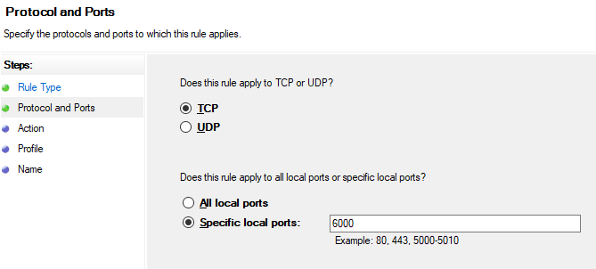
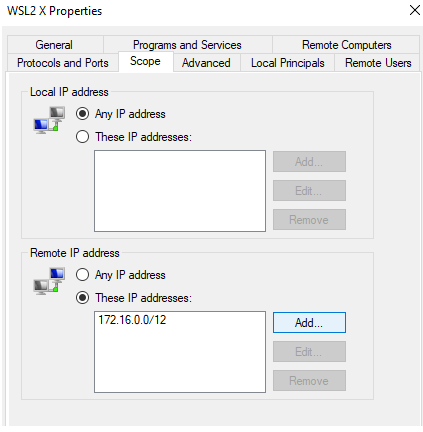
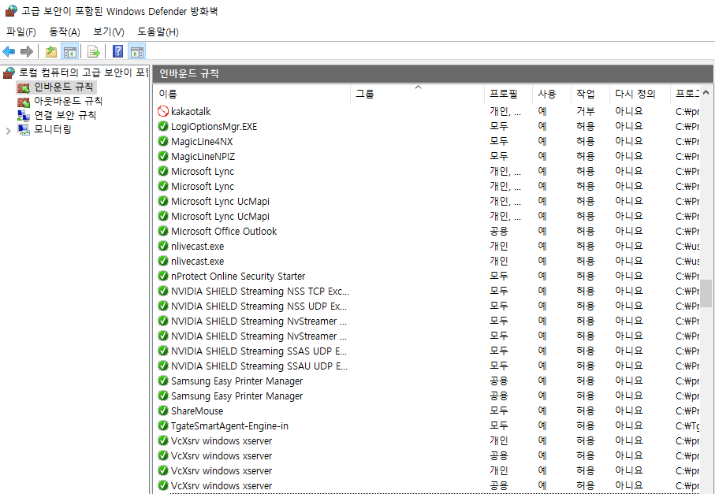

### X forwarding for RaspberryPi (Xserver) (Xwindow)
- https://www.raspberrypi.org/documentation/remote-access/ssh/unix.md

### MAC OSX
- https://www.xquartz.org/ 가 설치되어 있어야 함
- ssh -Y tinyos@**.**.**.** xeyes
  - 동작 안함 (2022.6.11) ssh -X ids@xxx.xxx.xxx.xxx -vvv -p72 xeyes

<pre> 
~/.xsession
startxfce4
</pre>

---

<pre>
( 이제는 아래 내용 사용하지 않아도 됨. )

OSX 터미널을 열어,

$ cd ~/.ssh
(만약 이 폴더가 없으면 ssh-keygen 명령을 수행하면 자동으로 만들어 진다)

$ vi config
host X11ubuntu
       Hostname ubuntu
       Port 22
       ForwardAgent yes
       ForwardX11 yes
</pre>

### 포트 확인
- netstat -tnlp
- nmap localhost

### Windows10 (WSL2) 설치, 실행 방법 (2021.8)
- (중요) VcXserv 실행시 Disable access contorl 을 체크해 줘야 함
- 아래처럼 방화벽 설청 필요

#### WSL Access via firewall
- "Firewall & Network Protection" >> advanced settings
- New Rule
- Protocol and Ports
  - 
- 해당 아이피 오픈
  - WSL2 는 가상머신에서 실행되고 있기 때문에, 해당 아이피를 확인(ifconfig)하여 마지막에 /12 추가함
  - 
  - <pre> export DISPLAY=$(awk '/nameserver / {print $2; exit}' /etc/resolv.conf 2>/dev/null):0 </pre>
  - <pre>export LIBGL_ALWAYS_INDIRECT=1 </pre>

#### 우분투 터미널 WSL2 에서 사용하기 위한 설정

  - Windows10 에서 설정
    - 제어판\시스템 및 보안\Windows Defender 방화벽
    - VcXsrv (또는 Xming) windows xserver 는 모두 허용으로 바꾸어야 함
    

- 로컬 윈도우즈에 xming 이나 X11 server가 설치되어 있어야 함 (VcXsrv 추천)
- ssh -Yf id@ipaddress {실행할 SW}
